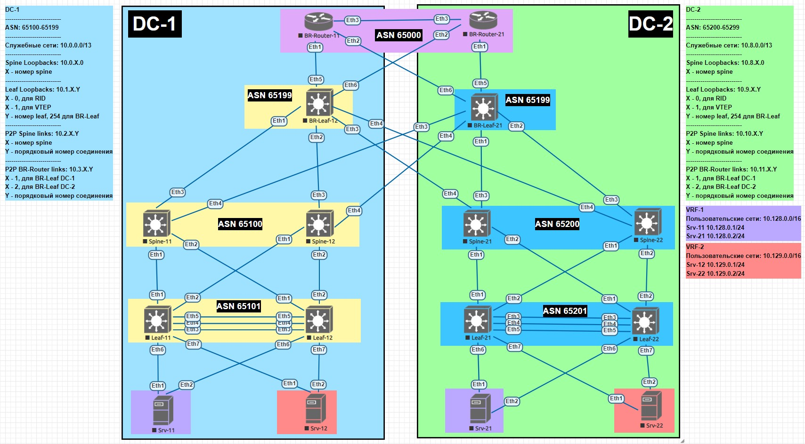

## Проектная работа.
#### Проектирование геораспределенной сети ЦОД.
#### Автор: 
- Шатунов Роман;
- Коновалов Артём. 

#### Цель:
Cпроектировать и реализовать геораспределенную, катастрофоустройчивую фабрику ЦОД для надежной работы сервисов предприятия. 

#### Задачи:
1. Выработать унифицированное решение для возможности применения в энтерпрайз сетях средного размера;
2. Обеспечить гибкость использующихся протоколов и элементов топологии.     

#### Топология 


#### Решение
Собрали стенд в реалиях EVE-NG и выполнили планирование адресного простраства 


Выполнили настройки.

#### Проверка результата

Проверка IP связности в VRF-1

```
Srv-11#ping 10.128.0.2
PING 10.128.0.2 (10.128.0.2) 72(100) bytes of data.
80 bytes from 10.128.0.2: icmp_seq=1 ttl=64 time=181 ms
80 bytes from 10.128.0.2: icmp_seq=1 ttl=64 time=186 ms (DUP!)
80 bytes from 10.128.0.2: icmp_seq=2 ttl=64 time=203 ms
80 bytes from 10.128.0.2: icmp_seq=2 ttl=64 time=208 ms (DUP!)
80 bytes from 10.128.0.2: icmp_seq=3 ttl=64 time=235 ms
80 bytes from 10.128.0.2: icmp_seq=4 ttl=64 time=280 ms
80 bytes from 10.128.0.2: icmp_seq=3 ttl=64 time=298 ms (DUP!)
80 bytes from 10.128.0.2: icmp_seq=5 ttl=64 time=285 ms

--- 10.128.0.2 ping statistics ---
5 packets transmitted, 5 received, +3 duplicates, 0% packet loss, time 43ms
rtt min/avg/max/mdev = 181.073/235.025/298.580/44.216 ms, pipe 5, ipg/ewma 10.84      
```

```
Srv-21#ping 10.128.0.1
PING 10.128.0.1 (10.128.0.1) 72(100) bytes of data.
80 bytes from 10.128.0.1: icmp_seq=1 ttl=64 time=32.0 ms
80 bytes from 10.128.0.1: icmp_seq=2 ttl=64 time=24.0 ms
80 bytes from 10.128.0.1: icmp_seq=3 ttl=64 time=23.4 ms
80 bytes from 10.128.0.1: icmp_seq=4 ttl=64 time=25.2 ms
80 bytes from 10.128.0.1: icmp_seq=5 ttl=64 time=28.7 ms

--- 10.128.0.1 ping statistics ---
5 packets transmitted, 5 received, 0% packet loss, time 83ms
rtt min/avg/max/mdev = 23.421/26.705/32.048/3.251 ms, pipe 3, ipg/ewma 20.942/29.398 ms
```

Проверка IP связности в VRF-2

```
Srv-12#ping 10.129.0.2
PING 10.129.0.2 (10.129.0.2) 72(100) bytes of data.
80 bytes from 10.129.0.2: icmp_seq=1 ttl=64 time=28.9 ms
80 bytes from 10.129.0.2: icmp_seq=2 ttl=64 time=22.7 ms
80 bytes from 10.129.0.2: icmp_seq=3 ttl=64 time=21.8 ms
80 bytes from 10.129.0.2: icmp_seq=4 ttl=64 time=21.5 ms

--- 10.129.0.2 ping statistics ---
5 packets transmitted, 4 received, 20% packet loss, time 77ms
rtt min/avg/max/mdev = 21.572/23.778/28.945/3.018 ms, pipe 3, ipg/ewma 19.297/26.653 ms
```

```
Srv-22#ping 10.129.0.1
PING 10.129.0.1 (10.129.0.1) 72(100) bytes of data.
80 bytes from 10.129.0.1: icmp_seq=1 ttl=64 time=28.9 ms
80 bytes from 10.129.0.1: icmp_seq=2 ttl=64 time=24.3 ms
80 bytes from 10.129.0.1: icmp_seq=3 ttl=64 time=24.3 ms
80 bytes from 10.129.0.1: icmp_seq=4 ttl=64 time=24.1 ms
80 bytes from 10.129.0.1: icmp_seq=5 ttl=64 time=21.2 ms

--- 10.129.0.1 ping statistics ---
5 packets transmitted, 5 received, 0% packet loss, time 78ms
rtt min/avg/max/mdev = 21.296/24.615/28.954/2.460 ms, pipe 3, ipg/ewma 19.640/26.643 ms
```

Проверка IP связности устройств между VRF-1 и VRF-2

```
Srv-11#ping 10.129.0.1
PING 10.129.0.1 (10.129.0.1) 72(100) bytes of data.
80 bytes from 10.129.0.1: icmp_seq=1 ttl=59 time=65.9 ms
80 bytes from 10.129.0.1: icmp_seq=2 ttl=59 time=60.2 ms
80 bytes from 10.129.0.1: icmp_seq=3 ttl=59 time=52.7 ms
80 bytes from 10.129.0.1: icmp_seq=4 ttl=59 time=45.2 ms
80 bytes from 10.129.0.1: icmp_seq=5 ttl=59 time=49.1 ms

--- 10.129.0.1 ping statistics ---
5 packets transmitted, 5 received, 0% packet loss, time 44ms
rtt min/avg/max/mdev = 45.222/54.658/65.967/7.516 ms, pipe 5, ipg/ewma 11.172/59.848 ms

Srv-11#ping 10.129.0.2
PING 10.129.0.2 (10.129.0.2) 72(100) bytes of data.
80 bytes from 10.129.0.2: icmp_seq=1 ttl=59 time=61.4 ms
80 bytes from 10.129.0.2: icmp_seq=2 ttl=59 time=53.4 ms
80 bytes from 10.129.0.2: icmp_seq=3 ttl=59 time=48.1 ms
80 bytes from 10.129.0.2: icmp_seq=4 ttl=59 time=60.3 ms
80 bytes from 10.129.0.2: icmp_seq=5 ttl=59 time=53.7 ms

--- 10.129.0.2 ping statistics ---
5 packets transmitted, 5 received, 0% packet loss, time 44ms
rtt min/avg/max/mdev = 48.195/55.457/61.462/4.894 ms, pipe 5, ipg/ewma 11.001/58.443 ms
Srv-11#     
```

```
Srv-12#ping 10.128.0.1
PING 10.128.0.1 (10.128.0.1) 72(100) bytes of data.
80 bytes from 10.128.0.1: icmp_seq=1 ttl=59 time=58.2 ms
80 bytes from 10.128.0.1: icmp_seq=2 ttl=59 time=50.8 ms
80 bytes from 10.128.0.1: icmp_seq=3 ttl=59 time=46.9 ms
80 bytes from 10.128.0.1: icmp_seq=4 ttl=59 time=44.5 ms
80 bytes from 10.128.0.1: icmp_seq=5 ttl=59 time=42.5 ms

--- 10.128.0.1 ping statistics ---
5 packets transmitted, 5 received, 0% packet loss, time 43ms
rtt min/avg/max/mdev = 42.575/48.655/58.291/5.555 ms, pipe 5, ipg/ewma 10.977/53.121 ms

Srv-12#ping 10.128.0.2
PING 10.128.0.2 (10.128.0.2) 72(100) bytes of data.
From 10.3.1.1 icmp_seq=1 Time to live exceeded
From 10.3.1.1 icmp_seq=2 Time to live exceeded
From 10.3.1.1 icmp_seq=3 Time to live exceeded
From 10.3.1.1 icmp_seq=4 Time to live exceeded
From 10.3.1.1 icmp_seq=5 Time to live exceeded

--- 10.128.0.2 ping statistics ---
5 packets transmitted, 0 received, +5 errors, 100% packet loss, time 44ms
pipe 5
Srv-12#
```

```
Srv-21#ping 10.129.0.1
PING 10.129.0.1 (10.129.0.1) 72(100) bytes of data.
80 bytes from 10.129.0.1: icmp_seq=1 ttl=47 time=622 ms
80 bytes from 10.129.0.1: icmp_seq=3 ttl=59 time=710 ms
80 bytes from 10.129.0.1: icmp_seq=4 ttl=59 time=913 ms
80 bytes from 10.129.0.1: icmp_seq=5 ttl=59 time=907 ms

--- 10.129.0.1 ping statistics ---
5 packets transmitted, 4 received, 20% packet loss, time 42ms
rtt min/avg/max/mdev = 622.962/788.655/913.548/125.935 ms, pipe 5, ipg/ewma 10.623/698.713 ms

Srv-21#ping 10.129.0.2
PING 10.129.0.2 (10.129.0.2) 72(100) bytes of data.
80 bytes from 10.129.0.2: icmp_seq=1 ttl=59 time=56.6 ms
80 bytes from 10.129.0.2: icmp_seq=2 ttl=59 time=51.5 ms
80 bytes from 10.129.0.2: icmp_seq=3 ttl=59 time=51.9 ms
80 bytes from 10.129.0.2: icmp_seq=4 ttl=59 time=44.8 ms
80 bytes from 10.129.0.2: icmp_seq=5 ttl=59 time=37.9 ms

--- 10.129.0.2 ping statistics ---
5 packets transmitted, 5 received, 0% packet loss, time 44ms
rtt min/avg/max/mdev = 37.973/48.601/56.604/6.498 ms, pipe 5, ipg/ewma 11.202/52.128 ms
Srv-21#
```

```
Srv-22#ping 10.128.0.1
PING 10.128.0.1 (10.128.0.1) 72(100) bytes of data.
80 bytes from 10.128.0.1: icmp_seq=1 ttl=59 time=43.4 ms
80 bytes from 10.128.0.1: icmp_seq=2 ttl=59 time=37.4 ms
80 bytes from 10.128.0.1: icmp_seq=3 ttl=59 time=31.9 ms
80 bytes from 10.128.0.1: icmp_seq=4 ttl=59 time=35.2 ms
80 bytes from 10.128.0.1: icmp_seq=5 ttl=59 time=36.3 ms

--- 10.128.0.1 ping statistics ---
5 packets transmitted, 5 received, 0% packet loss, time 75ms
rtt min/avg/max/mdev = 31.986/36.896/43.436/3.755 ms, pipe 4, ipg/ewma 18.753/40.060 ms

Srv-22#ping 10.128.0.2
PING 10.128.0.2 (10.128.0.2) 72(100) bytes of data.
80 bytes from 10.128.0.2: icmp_seq=1 ttl=59 time=48.4 ms
80 bytes from 10.128.0.2: icmp_seq=2 ttl=59 time=44.0 ms
80 bytes from 10.128.0.2: icmp_seq=3 ttl=59 time=43.4 ms
80 bytes from 10.128.0.2: icmp_seq=4 ttl=59 time=42.0 ms
80 bytes from 10.128.0.2: icmp_seq=5 ttl=59 time=39.0 ms

--- 10.128.0.2 ping statistics ---
5 packets transmitted, 5 received, 0% packet loss, time 42ms
rtt min/avg/max/mdev = 39.054/43.425/48.431/3.060 ms, pipe 5, ipg/ewma 10.614/45.726 ms
Srv-22#
```


