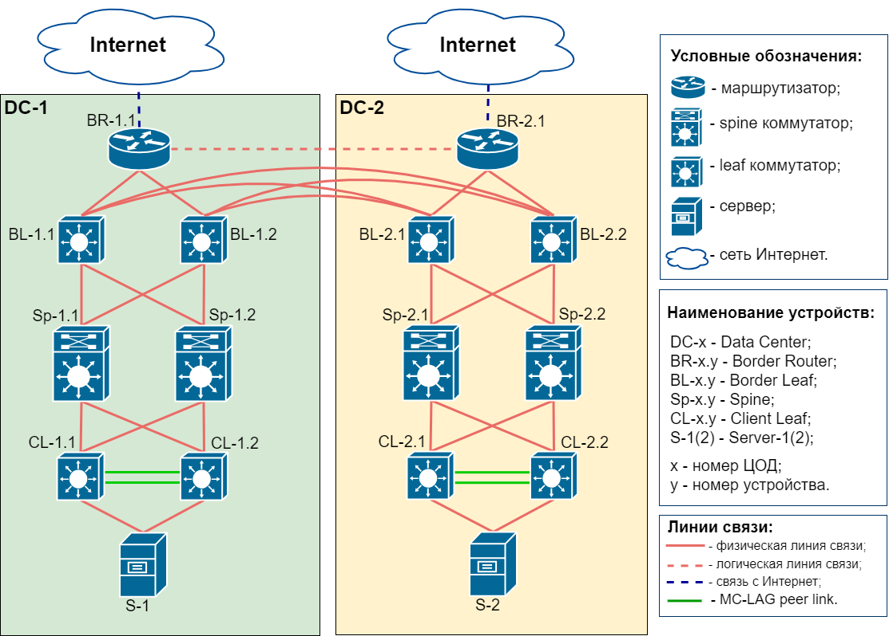

## Проектная работа.
### Описание. 
Для выполнения проектной работы хотим объединиться с Шатуновым Романом. Мы работаем в одной организации и наша идея реализовать гео-резервированную, катастрофоустойчивую фабрику ЦОД. Опираясь на опыт реализованных проектов и масштаб компании, предполагаем, что такое решение станет референсным. Унификация достигается за счет возможного отсутствия резервируемых элементов топологии, либо их земены. Например, вместо граничных маршрутизаторов (на топологии BR) будут фаерволы.    
### Топология. 
