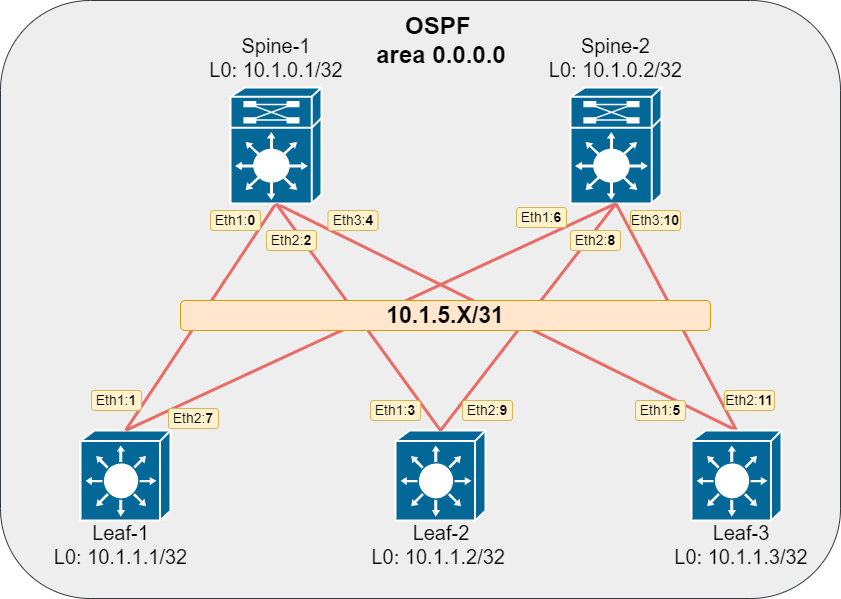

# Домашнее задание №2.
## Underlay. OSPF.
### Цель:
Настроить OSPF для Underlay сети

### Решение.
#### 1. Схема сети

#### 2. Адресное пространство

|Name|Loopback0|Eth-1|Eth-2|Eth-3|
|---|---|---|---|---|
Spine-1|10.1.0.1/32|10.1.5.0/31|10.1.5.2/31|10.1.5.4/31|
Spine-2|10.1.0.2/32|10.1.5.6/31|10.1.5.8/31|10.1.5.10/31|
Leaf-1|10.1.1.1/32|10.1.5.1/31|10.1.5.7/31|N/A|
Leaf-2|10.1.1.2/32|10.1.5.3/31|10.1.5.9/31|N/A|
Leaf-3|10.1.1.3/32|10.1.5.5/31|10.1.5.11/31|N/A|