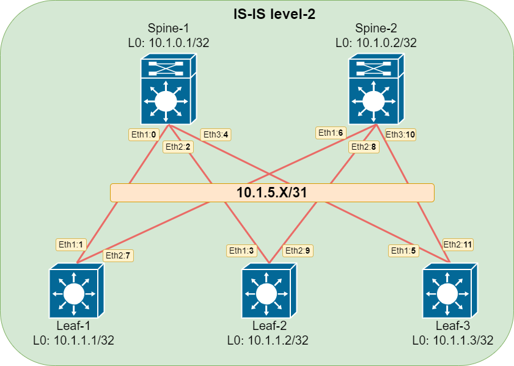

# Домашнее задание №3.
## Underlay. IS-IS.
### Цель:
Настроить IS-IS для Underlay сети

### Решение.
#### 1. Схема сети

Для Underlay сети реализуем IS-IS Level 2 топологию.



#### 2. Адресное пространство

Используем /31 маску для организации адресного простраснтва

|Name|Loopback0|Eth-1|Eth-2|Eth-3|
|---|---|---|---|---|
Spine-1|10.1.0.1/32|10.1.5.0/31|10.1.5.2/31|10.1.5.4/31|
Spine-2|10.1.0.2/32|10.1.5.6/31|10.1.5.8/31|10.1.5.10/31|
Leaf-1|10.1.1.1/32|10.1.5.1/31|10.1.5.7/31|N/A|
Leaf-2|10.1.1.2/32|10.1.5.3/31|10.1.5.9/31|N/A|
Leaf-3|10.1.1.3/32|10.1.5.5/31|10.1.5.11/31|N/A|

#### 3. Настройки

##### Spine-1
```
!
hostname Spine-1
!
interface Ethernet1
   description ### to_Leaf-1_eth1 ###
   no switchport
   ip address 10.1.5.0/31
   isis enable OTUS
   isis network point-to-point
   isis authentication mode text
   isis authentication key 7 Y5rbfDnzn74=
!
interface Ethernet2
   description ### to_Leaf-2_eth1 ###
   no switchport
   ip address 10.1.5.2/31
   isis enable OTUS
   isis network point-to-point
   isis authentication mode text
   isis authentication key 7 Y5rbfDnzn74=
!
interface Ethernet3
   description ### to_Leaf-3_eth1 ###
   no switchport
   ip address 10.1.5.4/31
   isis enable OTUS
   isis network point-to-point
   isis authentication mode text
   isis authentication key 7 Y5rbfDnzn74=
!
interface Loopback0
   ip address 10.1.0.1/32
   isis enable OTUS
!
ip routing
!
router isis OTUS
   net 49.0011.0100.0100.0001.00
   is-type level-2
   !
   address-family ipv4 unicast
      bfd all-interfaces
!
```
##### Spine-2
```
!
hostname Spine-2
!
interface Ethernet1
   description ### to_Leaf-1_eth2 ###
   no switchport
   ip address 10.1.5.6/31
   isis enable OTUS
   isis network point-to-point
   isis authentication mode text
   isis authentication key 7 Y5rbfDnzn74=
!
interface Ethernet2
   description ### to_Leaf-2_eth2 ###
   no switchport
   ip address 10.1.5.8/31
   isis enable OTUS
   isis network point-to-point
   isis authentication mode text
   isis authentication key 7 Y5rbfDnzn74=
!
interface Ethernet3
   description ### to_Leaf-3_eth2 ###
   no switchport
   ip address 10.1.5.10/31
   isis enable OTUS
   isis network point-to-point
   isis authentication mode text
   isis authentication key 7 Y5rbfDnzn74=
!
interface Loopback0
   ip address 10.1.0.2/32
   isis enable OTUS
!
ip routing
!
router isis OTUS
   net 49.0011.0100.0100.0002.00
   is-type level-2
   !
   address-family ipv4 unicast
      bfd all-interfaces
!
```
##### Leaf-1
```
!
hostname Leaf-1
!
interface Ethernet1
   description ### to_Spine-1_eth1 ###
   no switchport
   ip address 10.1.5.1/31
   isis enable OTUS
   isis network point-to-point
   isis authentication mode text
   isis authentication key 7 Y5rbfDnzn74=
!
interface Ethernet2
   description ### to_Spine-2_eth1 ###
   no switchport
   ip address 10.1.5.7/31
   isis enable OTUS
   isis network point-to-point
   isis authentication mode text
   isis authentication key 7 Y5rbfDnzn74=
!
interface Loopback0
   ip address 10.1.1.1/32
   isis enable OTUS
!
ip routing
!
router isis OTUS
   net 49.0011.0100.0100.1001.00
   is-type level-2
   !
   address-family ipv4 unicast
      bfd all-interfaces
!
```
##### Leaf-2 
```
!
hostname Leaf-2
!
interface Ethernet1
   description ### to_Spine-1_eth2 ###
   no switchport
   ip address 10.1.5.3/31
   isis enable OTUS
   isis network point-to-point
   isis authentication mode text
   isis authentication key 7 Y5rbfDnzn74=
!
interface Ethernet2
   description ### to_Spine-2_eth2 ###
   no switchport
   ip address 10.1.5.9/31
   isis enable OTUS
   isis network point-to-point
   isis authentication mode text
   isis authentication key 7 Y5rbfDnzn74=
!
interface Loopback0
   ip address 10.1.1.2/32
   isis enable OTUS
!
ip routing
!
router isis OTUS
   net 49.0011.0100.0100.1002.00
   is-type level-2
   !
   address-family ipv4 unicast
      bfd all-interfaces
!
```
##### Leaf-3
```
!
hostname Leaf-3
!
interface Ethernet1
   description ### to_Spine-1_eth3 ###
   no switchport
   ip address 10.1.5.5/31
   isis enable OTUS
   isis network point-to-point
   isis authentication mode text
   isis authentication key 7 Y5rbfDnzn74=
!
interface Ethernet2
   description ### to_Spine-2_eth3 ###
   no switchport
   ip address 10.1.5.11/31
   isis enable OTUS
   isis network point-to-point
   isis authentication mode text
   isis authentication key 7 Y5rbfDnzn74=
!
interface Loopback0
   ip address 10.1.1.3/32
   isis enable OTUS
!
ip routing
!
router isis OTUS
   net 49.0011.0100.0100.1003.00
   is-type level-2
   !
   address-family ipv4 unicast
      bfd all-interfaces
!
```

#### 4. Демонстрация работы настроек протокола OSPF

#### Spine-1
```
Spine-1#show isis neighbors

Instance  VRF      System Id        Type Interface          SNPA              State Hold time   Circuit Id
OTUS      default  Leaf-1           L2   Ethernet1          P2P               UP    29          0F
OTUS      default  Leaf-2           L2   Ethernet2          P2P               UP    29          0F
OTUS      default  Leaf-3           L2   Ethernet3          P2P               UP    22          0F
Spine-1#
```

```
Spine-1#show ip route isis

VRF: default
Codes: C - connected, S - static, K - kernel,
       O - OSPF, IA - OSPF inter area, E1 - OSPF external type 1,
       E2 - OSPF external type 2, N1 - OSPF NSSA external type 1,
       N2 - OSPF NSSA external type2, B I - iBGP, B E - eBGP,
       R - RIP, I L1 - IS-IS level 1, I L2 - IS-IS level 2,
       O3 - OSPFv3, A B - BGP Aggregate, A O - OSPF Summary,
       NG - Nexthop Group Static Route, V - VXLAN Control Service,
       DH - Dhcp client installed default route

 I L2   10.1.0.2/32 [115/30] via 10.1.5.1, Ethernet1
                             via 10.1.5.3, Ethernet2
                             via 10.1.5.5, Ethernet3
 I L2   10.1.1.1/32 [115/20] via 10.1.5.1, Ethernet1
 I L2   10.1.1.2/32 [115/20] via 10.1.5.3, Ethernet2
 I L2   10.1.1.3/32 [115/20] via 10.1.5.5, Ethernet3
 I L2   10.1.5.6/31 [115/20] via 10.1.5.1, Ethernet1
 I L2   10.1.5.8/31 [115/20] via 10.1.5.3, Ethernet2
 I L2   10.1.5.10/31 [115/20] via 10.1.5.5, Ethernet3

Spine-1#
```

```
Spine-1#show isis database

IS-IS Instance: OTUS VRF: default
  IS-IS Level 2 Link State Database
    LSPID                 Seq Num   Cksum  Life  IS Flags
    Spine-1.00-00         147       41255  1020  L2 <>
    Spine-2.00-00         151       17751  806   L2 <>
    Leaf-1.00-00          142       46126  931   L2 <>
    Leaf-2.00-00          141       29540  480   L2 <>
    Leaf-3.00-00          141       9638   575   L2 <>
Spine-1#
```

```
Spine-1#show isis database level-2

IS-IS Instance: OTUS VRF: default
  IS-IS Level 2 Link State Database
    LSPID                 Seq Num   Cksum  Life  IS Flags
    Spine-1.00-00         147       41255  997   L2 <>
    Spine-2.00-00         151       17751  783   L2 <>
    Leaf-1.00-00          142       46126  908   L2 <>
    Leaf-2.00-00          141       29540  457   L2 <>
    Leaf-3.00-00          141       9638   552   L2 <>
Spine-1#
```

```
Spine-1#show bfd neighbors
VRF name: default
-----------------
DstAddr      MyDisc   YourDisc     Interface    Type          LastUp  LastDown
-------- ---------- ---------- -------------- ------- --------------- ---------
10.1.5.1 3342111683 2999435826 Ethernet1(15)  normal  06/16/23 12:19        NA
10.1.5.3  675853340  893035205 Ethernet2(16)  normal  06/16/23 12:22        NA
10.1.5.5 2554756874 2118370135 Ethernet3(17)  normal  06/16/23 12:25        NA

        LastDiag    State
------------------- -----
   No Diagnostic       Up
   No Diagnostic       Up
   No Diagnostic       Up

Spine-1#
```

##### Spine-2
```
Spine-2#show isis neighbors

Instance  VRF      System Id        Type Interface          SNPA              State Hold time   Circuit Id
OTUS      default  Leaf-1           L2   Ethernet1          P2P               UP    22          10
OTUS      default  Leaf-2           L2   Ethernet2          P2P               UP    22          10
OTUS      default  Leaf-3           L2   Ethernet3          P2P               UP    25          10
Spine-2#
```

```
Spine-2#show ip route isis

VRF: default
Codes: C - connected, S - static, K - kernel,
       O - OSPF, IA - OSPF inter area, E1 - OSPF external type 1,
       E2 - OSPF external type 2, N1 - OSPF NSSA external type 1,
       N2 - OSPF NSSA external type2, B I - iBGP, B E - eBGP,
       R - RIP, I L1 - IS-IS level 1, I L2 - IS-IS level 2,
       O3 - OSPFv3, A B - BGP Aggregate, A O - OSPF Summary,
       NG - Nexthop Group Static Route, V - VXLAN Control Service,
       DH - Dhcp client installed default route

 I L2   10.1.0.1/32 [115/30] via 10.1.5.7, Ethernet1
                             via 10.1.5.9, Ethernet2
                             via 10.1.5.11, Ethernet3
 I L2   10.1.1.1/32 [115/20] via 10.1.5.7, Ethernet1
 I L2   10.1.1.2/32 [115/20] via 10.1.5.9, Ethernet2
 I L2   10.1.1.3/32 [115/20] via 10.1.5.11, Ethernet3
 I L2   10.1.5.0/31 [115/20] via 10.1.5.7, Ethernet1
 I L2   10.1.5.2/31 [115/20] via 10.1.5.9, Ethernet2
 I L2   10.1.5.4/31 [115/20] via 10.1.5.11, Ethernet3

Spine-2#
```

```
Spine-2#show isis database

IS-IS Instance: OTUS VRF: default
  IS-IS Level 2 Link State Database
    LSPID                 Seq Num   Cksum  Life  IS Flags
    Spine-1.00-00         147       41255  818   L2 <>
    Spine-2.00-00         151       17751  608   L2 <>
    Leaf-1.00-00          142       46126  731   L2 <>
    Leaf-2.00-00          142       29029  1034  L2 <>
    Leaf-3.00-00          142       9127   1182  L2 <>
Spine-2#
```

```
Spine-2#show isis database level-2

IS-IS Instance: OTUS VRF: default
  IS-IS Level 2 Link State Database
    LSPID                 Seq Num   Cksum  Life  IS Flags
    Spine-1.00-00         147       41255  797   L2 <>
    Spine-2.00-00         151       17751  587   L2 <>
    Leaf-1.00-00          142       46126  710   L2 <>
    Leaf-2.00-00          142       29029  1013  L2 <>
    Leaf-3.00-00          142       9127   1161  L2 <>
Spine-2#
```

```
Spine-2#show bfd neighbors
VRF name: default
-----------------
DstAddr       MyDisc   YourDisc     Interface   Type          LastUp  LastDown
--------- ---------- ---------- ------------- ------- --------------- ---------
10.1.5.7  4168898474  904798458 Ethernet1(15) normal  06/16/23 12:21        NA
10.1.5.9  4198001555  481353156 Ethernet2(16) normal  06/16/23 12:24        NA
10.1.5.11 3852585724 1272832778 Ethernet3(17) normal  06/16/23 12:27        NA

        LastDiag    State
------------------- -----
   No Diagnostic       Up
   No Diagnostic       Up
   No Diagnostic       Up

Spine-2#
```

##### Leaf-1
```
Leaf-1#show isis neighbors

Instance  VRF      System Id        Type Interface          SNPA              State Hold time   Circuit Id
OTUS      default  Spine-1          L2   Ethernet1          P2P               UP    28          0F
OTUS      default  Spine-2          L2   Ethernet2          P2P               UP    25          10
Leaf-1#
```

```
Leaf-1#show ip route isis

VRF: default
Codes: C - connected, S - static, K - kernel,
       O - OSPF, IA - OSPF inter area, E1 - OSPF external type 1,
       E2 - OSPF external type 2, N1 - OSPF NSSA external type 1,
       N2 - OSPF NSSA external type2, B I - iBGP, B E - eBGP,
       R - RIP, I L1 - IS-IS level 1, I L2 - IS-IS level 2,
       O3 - OSPFv3, A B - BGP Aggregate, A O - OSPF Summary,
       NG - Nexthop Group Static Route, V - VXLAN Control Service,
       DH - Dhcp client installed default route

 I L2   10.1.0.1/32 [115/20] via 10.1.5.0, Ethernet1
 I L2   10.1.0.2/32 [115/20] via 10.1.5.6, Ethernet2
 I L2   10.1.1.2/32 [115/30] via 10.1.5.0, Ethernet1
                             via 10.1.5.6, Ethernet2
 I L2   10.1.1.3/32 [115/30] via 10.1.5.0, Ethernet1
                             via 10.1.5.6, Ethernet2
 I L2   10.1.5.2/31 [115/20] via 10.1.5.0, Ethernet1
 I L2   10.1.5.4/31 [115/20] via 10.1.5.0, Ethernet1
 I L2   10.1.5.8/31 [115/20] via 10.1.5.6, Ethernet2
 I L2   10.1.5.10/31 [115/20] via 10.1.5.6, Ethernet2

Leaf-1#
```

```
Leaf-1#show isis database

IS-IS Instance: OTUS VRF: default
  IS-IS Level 2 Link State Database
    LSPID                 Seq Num   Cksum  Life  IS Flags
    Spine-1.00-00         147       41255  713   L2 <>
    Spine-2.00-00         152       17240  1179  L2 <>
    Leaf-1.00-00          142       46126  626   L2 <>
    Leaf-2.00-00          142       29029  926   L2 <>
    Leaf-3.00-00          142       9127   1075  L2 <>
```

```
Leaf-1#show isis database level-2

IS-IS Instance: OTUS VRF: default
  IS-IS Level 2 Link State Database
    LSPID                 Seq Num   Cksum  Life  IS Flags
    Spine-1.00-00         147       41255  708   L2 <>
    Spine-2.00-00         152       17240  1174  L2 <>
    Leaf-1.00-00          142       46126  621   L2 <>
    Leaf-2.00-00          142       29029  921   L2 <>
    Leaf-3.00-00          142       9127   1070  L2 <>
Leaf-1#
```

```
Leaf-1#show bfd neighbors
VRF name: default
-----------------
DstAddr      MyDisc   YourDisc     Interface    Type          LastUp  LastDown
-------- ---------- ---------- -------------- ------- --------------- ---------
10.1.5.0 2999435826 3342111683 Ethernet1(15)  normal  06/16/23 12:20        NA
10.1.5.6  904798458 4168898474 Ethernet2(16)  normal  06/16/23 12:20        NA

        LastDiag    State
------------------- -----
   No Diagnostic       Up
   No Diagnostic       Up

Leaf-1#
```

##### Leaf-2 
```
```

```
```

```
```

##### Leaf-3
```
```

```
```

```
```

