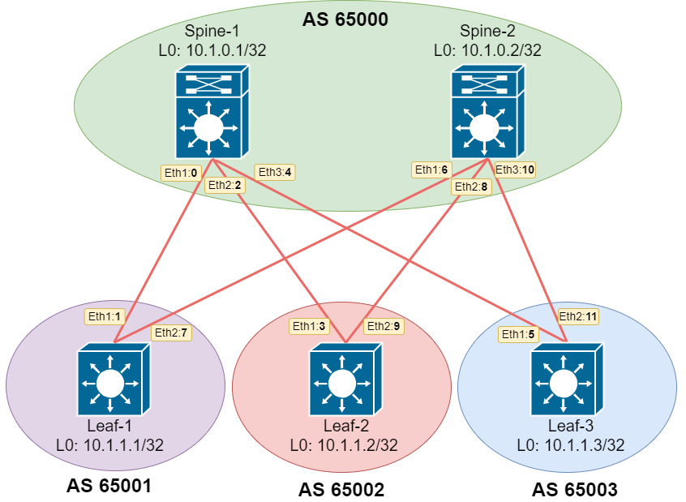

# Домашнее задание №4.
## Underlay. eBGP.
### Цель:
Настроить eBGP для Underlay сети

### Решение.
#### 1. Схема сети

Для Underlay сети реализуем eBGP связность, выделив SPINE в одну AS и каждый LEAF в уникальную AS. 



#### 2. Адресное пространство

Используем /31 маску для организации адресного простраснтва

|Name|Loopback0|Eth-1|Eth-2|Eth-3|
|---|---|---|---|---|
Spine-1|10.1.0.1/32|10.1.5.0/31|10.1.5.2/31|10.1.5.4/31|
Spine-2|10.1.0.2/32|10.1.5.6/31|10.1.5.8/31|10.1.5.10/31|
Leaf-1|10.1.1.1/32|10.1.5.1/31|10.1.5.7/31|N/A|
Leaf-2|10.1.1.2/32|10.1.5.3/31|10.1.5.9/31|N/A|
Leaf-3|10.1.1.3/32|10.1.5.5/31|10.1.5.11/31|N/A|

#### 3. Настройки

##### Spine-1
```
!
hostname Spine-1
!
interface Ethernet1
   description ### to_Leaf-1_eth1 ###
   no switchport
   ip address 10.1.5.0/31
   no ip ospf bfd
!
interface Ethernet2
   description ### to_Leaf-2_eth1 ###
   no switchport
   ip address 10.1.5.2/31
   no ip ospf bfd
!
interface Ethernet3
   description ### to_Leaf-3_eth1 ###
   no switchport
   ip address 10.1.5.4/31
   no ip ospf bfd
!
interface Loopback0
   ip address 10.1.0.1/32
!
ip routing
!
peer-filter LAB_OTUS_COD
   10 match as-range 65001-65003 result accept
!
router bgp 65000
   router-id 10.1.0.1
   maximum-paths 3
   bgp listen range 10.1.0.0/16 peer-group OTUS_LEAF peer-filter LAB_OTUS_COD
   neighbor OTUS_LEAF peer-group
   neighbor OTUS_LEAF fall-over bfd
   neighbor OTUS_LEAF password 7 +/ddbal+Y1I=
   neighbor OTUS_LEAF maximum-routes 12000
   network 10.1.0.1/32
!
```
##### Spine-2
```
!
hostname Spine-2
!
interface Ethernet1
   description ### to_Leaf-1_eth2 ###
   no switchport
   ip address 10.1.5.6/31
   no ip ospf bfd
!
interface Ethernet2
   description ### to_Leaf-2_eth2 ###
   no switchport
   ip address 10.1.5.8/31
   no ip ospf bfd
!
interface Ethernet3
   description ### to_Leaf-3_eth2 ###
   no switchport
   ip address 10.1.5.10/31
   no ip ospf bfd
!
interface Loopback0
   ip address 10.1.0.2/32
!
ip routing
!
peer-filter LAB_OTUS_COD
   10 match as-range 65001-65003 result accept
!
router bgp 65000
   router-id 10.1.0.2
   maximum-paths 3
   bgp listen range 10.1.0.0/16 peer-group OTUS_LEAF peer-filter LAB_OTUS_COD
   neighbor OTUS_LEAF peer-group
   neighbor OTUS_LEAF fall-over bfd
   neighbor OTUS_LEAF password 7 +/ddbal+Y1I=
   neighbor OTUS_LEAF maximum-routes 12000
   network 10.1.0.2/32
!
```
##### Leaf-1
```
!
hostname Leaf-1
!
interface Ethernet1
   description ### to_Spine-1_eth1 ###
   no switchport
   ip address 10.1.5.1/31
   no ip ospf bfd
!
interface Ethernet2
   description ### to_Spine-2_eth1 ###
   no switchport
   ip address 10.1.5.7/31
   no ip ospf bfd
!
interface Loopback0
   ip address 10.1.1.1/32
!
ip routing
!
router bgp 65001
   router-id 10.1.1.1
   maximum-paths 3
   neighbor OTUS_SPINE peer-group
   neighbor OTUS_SPINE remote-as 65000
   neighbor OTUS_SPINE fall-over bfd
   neighbor OTUS_SPINE password 7 kCt/R/lTQ8E=
   neighbor OTUS_SPINE maximum-routes 12000
   neighbor 10.1.5.0 peer-group OTUS_SPINE
   neighbor 10.1.5.6 peer-group OTUS_SPINE
   network 10.1.1.1/32
!
```
##### Leaf-2 
```
!
hostname Leaf-2
!
interface Ethernet1
   description ### to_Spine-1_eth2 ###
   no switchport
   ip address 10.1.5.3/31
   no ip ospf bfd
!
interface Ethernet2
   description ### to_Spine-2_eth2 ###
   no switchport
   ip address 10.1.5.9/31
   no ip ospf bfd
!
interface Loopback0
   ip address 10.1.1.2/32
!
ip routing
!
router bgp 65002
   router-id 10.1.1.2
   maximum-paths 3
   neighbor OTUS_SPINE peer-group
   neighbor OTUS_SPINE remote-as 65000
   neighbor OTUS_SPINE fall-over bfd
   neighbor OTUS_SPINE password 7 kCt/R/lTQ8E=
   neighbor OTUS_SPINE maximum-routes 12000
   neighbor 10.1.5.2 peer-group OTUS_SPINE
   neighbor 10.1.5.8 peer-group OTUS_SPINE
   network 10.1.1.2/32
!
```
##### Leaf-3
```
!
hostname Leaf-3
!
interface Ethernet1
   description ### to_Spine-1_eth3 ###
   no switchport
   ip address 10.1.5.5/31
   no ip ospf bfd
!
interface Ethernet2
   description ### to_Spine-2_eth3 ###
   no switchport
   ip address 10.1.5.11/31
   no ip ospf bfd
!
interface Loopback0
   ip address 10.1.1.3/32
!
ip routing
!
router bgp 65003
   router-id 10.1.1.3
   maximum-paths 3
   neighbor OTUS_SPINE peer-group
   neighbor OTUS_SPINE remote-as 65000
   neighbor OTUS_SPINE fall-over bfd
   neighbor OTUS_SPINE password 7 kCt/R/lTQ8E=
   neighbor OTUS_SPINE maximum-routes 12000
   neighbor 10.1.5.4 peer-group OTUS_SPINE
   neighbor 10.1.5.10 peer-group OTUS_SPINE
   network 10.1.1.3/32
!
```

#### 4. Демонстрация работы настроек протокола eBGP.

#### Spine-1
```
Spine-1#show ip bgp summary
BGP summary information for VRF default
Router identifier 10.1.0.1, local AS number 65000
Neighbor Status Codes: m - Under maintenance
  Neighbor         V  AS           MsgRcvd   MsgSent  InQ OutQ  Up/Down State  PfxRcd PfxAcc
  10.1.5.1         4  65001           1413      1412    0    0 23:19:23 Estab  1      1
  10.1.5.3         4  65002           1398      1395    0    0 23:08:26 Estab  1      1
  10.1.5.5         4  65003           1396      1397    0    0 23:08:00 Estab  1      1
Spine-1#
```

```
Spine-1#show bfd neighbors
VRF name: default
-----------------
DstAddr      MyDisc   YourDisc     Interface    Type          LastUp  LastDown
-------- ---------- ---------- -------------- ------- --------------- ---------
10.1.5.1   51551370 1313093824 Ethernet1(15)  normal  06/22/23 12:42        NA
10.1.5.3 2371960823 1020159600 Ethernet2(16)  normal  06/22/23 12:42        NA
10.1.5.5 2887977675 4143689526 Ethernet3(17)  normal  06/22/23 12:42        NA

        LastDiag    State
------------------- -----
   No Diagnostic       Up
   No Diagnostic       Up
   No Diagnostic       Up

Spine-1#
```

```
Spine-1#show ip bgp
BGP routing table information for VRF default
Router identifier 10.1.0.1, local AS number 65000
Route status codes: s - suppressed, * - valid, > - active, # - not installed, E - ECMP head, e - ECMP
                    S - Stale, c - Contributing to ECMP, b - backup, L - labeled-unicast
Origin codes: i - IGP, e - EGP, ? - incomplete
AS Path Attributes: Or-ID - Originator ID, C-LST - Cluster List, LL Nexthop - Link Local Nexthop

        Network                Next Hop              Metric  LocPref Weight  Path
 * >    10.1.0.1/32            -                     0       0       -       i
 * >    10.1.1.1/32            10.1.5.1              0       100     0       65001 i
 * >    10.1.1.2/32            10.1.5.3              0       100     0       65002 i
 * >    10.1.1.3/32            10.1.5.5              0       100     0       65003 i
Spine-1#
```

```
Spine-1#show ip route

VRF: default
Codes: C - connected, S - static, K - kernel,
       O - OSPF, IA - OSPF inter area, E1 - OSPF external type 1,
       E2 - OSPF external type 2, N1 - OSPF NSSA external type 1,
       N2 - OSPF NSSA external type2, B I - iBGP, B E - eBGP,
       R - RIP, I L1 - IS-IS level 1, I L2 - IS-IS level 2,
       O3 - OSPFv3, A B - BGP Aggregate, A O - OSPF Summary,
       NG - Nexthop Group Static Route, V - VXLAN Control Service,
       DH - Dhcp client installed default route

Gateway of last resort is not set

 C      10.1.0.1/32 is directly connected, Loopback0
 B E    10.1.1.1/32 [200/0] via 10.1.5.1, Ethernet1
 B E    10.1.1.2/32 [200/0] via 10.1.5.3, Ethernet2
 B E    10.1.1.3/32 [200/0] via 10.1.5.5, Ethernet3
 C      10.1.5.0/31 is directly connected, Ethernet1
 C      10.1.5.2/31 is directly connected, Ethernet2
 C      10.1.5.4/31 is directly connected, Ethernet3

Spine-1#
```

##### Spine-2
```
Spine-2#show ip bgp summary
BGP summary information for VRF default
Router identifier 10.1.0.2, local AS number 65000
Neighbor Status Codes: m - Under maintenance
  Neighbor         V  AS           MsgRcvd   MsgSent  InQ OutQ  Up/Down State  PfxRcd PfxAcc
  10.1.5.7         4  65001           1754      1754    0    0    1d05h Estab  1      1
  10.1.5.9         4  65002           1405      1402    0    0 23:15:51 Estab  1      1
  10.1.5.11        4  65003           1404      1403    0    0 23:14:43 Estab  1      1
Spine-2#
```

```
Spine-2#show bfd neighbors
VRF name: default
-----------------
DstAddr       MyDisc   YourDisc     Interface   Type          LastUp  LastDown
--------- ---------- ---------- ------------- ------- --------------- ---------
10.1.5.7  2966212945 3370647768 Ethernet1(15) normal  06/22/23 12:43        NA
10.1.5.9  4233648242 1346450395 Ethernet2(16) normal  06/22/23 12:43        NA
10.1.5.11  524916101 2606567882 Ethernet3(17) normal  06/22/23 12:43        NA

        LastDiag    State
------------------- -----
   No Diagnostic       Up
   No Diagnostic       Up
   No Diagnostic       Up

Spine-2#
```

```
Spine-2#show ip bgp
BGP routing table information for VRF default
Router identifier 10.1.0.2, local AS number 65000
Route status codes: s - suppressed, * - valid, > - active, # - not installed, E - ECMP head, e - ECMP
                    S - Stale, c - Contributing to ECMP, b - backup, L - labeled-unicast
Origin codes: i - IGP, e - EGP, ? - incomplete
AS Path Attributes: Or-ID - Originator ID, C-LST - Cluster List, LL Nexthop - Link Local Nexthop

        Network                Next Hop              Metric  LocPref Weight  Path
 * >    10.1.0.2/32            -                     0       0       -       i
 * >    10.1.1.1/32            10.1.5.7              0       100     0       65001 i
 * >    10.1.1.2/32            10.1.5.9              0       100     0       65002 i
 * >    10.1.1.3/32            10.1.5.11             0       100     0       65003 i
Spine-2#
```

```
Spine-2#show ip route

VRF: default
Codes: C - connected, S - static, K - kernel,
       O - OSPF, IA - OSPF inter area, E1 - OSPF external type 1,
       E2 - OSPF external type 2, N1 - OSPF NSSA external type 1,
       N2 - OSPF NSSA external type2, B I - iBGP, B E - eBGP,
       R - RIP, I L1 - IS-IS level 1, I L2 - IS-IS level 2,
       O3 - OSPFv3, A B - BGP Aggregate, A O - OSPF Summary,
       NG - Nexthop Group Static Route, V - VXLAN Control Service,
       DH - Dhcp client installed default route

Gateway of last resort is not set

 C      10.1.0.2/32 is directly connected, Loopback0
 B E    10.1.1.1/32 [200/0] via 10.1.5.7, Ethernet1
 B E    10.1.1.2/32 [200/0] via 10.1.5.9, Ethernet2
 B E    10.1.1.3/32 [200/0] via 10.1.5.11, Ethernet3
 C      10.1.5.6/31 is directly connected, Ethernet1
 C      10.1.5.8/31 is directly connected, Ethernet2
 C      10.1.5.10/31 is directly connected, Ethernet3

Spine-2#
```

##### Leaf-1
```
Leaf-1#show ip bgp summary
BGP summary information for VRF default
Router identifier 10.1.1.1, local AS number 65001
Neighbor Status Codes: m - Under maintenance
  Neighbor         V  AS           MsgRcvd   MsgSent  InQ OutQ  Up/Down State  PfxRcd PfxAcc
  10.1.5.0         4  65000           1763      1764    0    0 23:30:27 Estab  3      3
  10.1.5.6         4  65000           1758      1758    0    0    1d05h Estab  3      3
Leaf-1#
```

```
Leaf-1#show bfd neighbors
VRF name: default
-----------------
DstAddr      MyDisc   YourDisc     Interface    Type          LastUp  LastDown
-------- ---------- ---------- -------------- ------- --------------- ---------
10.1.5.0 1313093824   51551370 Ethernet1(15)  normal  06/22/23 12:43        NA
10.1.5.6 3370647768 2966212945 Ethernet2(16)  normal  06/22/23 12:44        NA

        LastDiag    State
------------------- -----
   No Diagnostic       Up
   No Diagnostic       Up

Leaf-1#
```

```
Leaf-1#show ip bgp
BGP routing table information for VRF default
Router identifier 10.1.1.1, local AS number 65001
Route status codes: s - suppressed, * - valid, > - active, # - not installed, E - ECMP head, e - ECMP
                    S - Stale, c - Contributing to ECMP, b - backup, L - labeled-unicast
Origin codes: i - IGP, e - EGP, ? - incomplete
AS Path Attributes: Or-ID - Originator ID, C-LST - Cluster List, LL Nexthop - Link Local Nexthop

        Network                Next Hop              Metric  LocPref Weight  Path
 * >    10.1.0.1/32            10.1.5.0              0       100     0       65000 i
 * >    10.1.0.2/32            10.1.5.6              0       100     0       65000 i
 * >    10.1.1.1/32            -                     0       0       -       i
 * >Ec  10.1.1.2/32            10.1.5.6              0       100     0       65000 65002 i
 *  ec  10.1.1.2/32            10.1.5.0              0       100     0       65000 65002 i
 * >Ec  10.1.1.3/32            10.1.5.0              0       100     0       65000 65003 i
 *  ec  10.1.1.3/32            10.1.5.6              0       100     0       65000 65003 i
Leaf-1#
```

```
Leaf-1#show ip route

VRF: default
Codes: C - connected, S - static, K - kernel,
       O - OSPF, IA - OSPF inter area, E1 - OSPF external type 1,
       E2 - OSPF external type 2, N1 - OSPF NSSA external type 1,
       N2 - OSPF NSSA external type2, B I - iBGP, B E - eBGP,
       R - RIP, I L1 - IS-IS level 1, I L2 - IS-IS level 2,
       O3 - OSPFv3, A B - BGP Aggregate, A O - OSPF Summary,
       NG - Nexthop Group Static Route, V - VXLAN Control Service,
       DH - Dhcp client installed default route

Gateway of last resort is not set

 B E    10.1.0.1/32 [200/0] via 10.1.5.0, Ethernet1
 B E    10.1.0.2/32 [200/0] via 10.1.5.6, Ethernet2
 C      10.1.1.1/32 is directly connected, Loopback0
 B E    10.1.1.2/32 [200/0] via 10.1.5.0, Ethernet1
                            via 10.1.5.6, Ethernet2
 B E    10.1.1.3/32 [200/0] via 10.1.5.0, Ethernet1
                            via 10.1.5.6, Ethernet2
 C      10.1.5.0/31 is directly connected, Ethernet1
 C      10.1.5.6/31 is directly connected, Ethernet2

Leaf-1#
```

##### Leaf-2 
```
Leaf-2#show ip bgp summary
BGP summary information for VRF default
Router identifier 10.1.1.2, local AS number 65002
Neighbor Status Codes: m - Under maintenance
  Neighbor         V  AS           MsgRcvd   MsgSent  InQ OutQ  Up/Down State  PfxRcd PfxAcc
  10.1.5.2         4  65000           1739      1743    0    0 23:23:00 Estab  3      3
  10.1.5.8         4  65000           1741      1747    0    0 23:23:41 Estab  3      3
Leaf-2#
```

```
Leaf-2#show bfd neighbors
VRF name: default
-----------------
DstAddr      MyDisc   YourDisc     Interface    Type          LastUp  LastDown
-------- ---------- ---------- -------------- ------- --------------- ---------
10.1.5.2 1020159600 2371960823 Ethernet1(15)  normal  06/22/23 12:43        NA
10.1.5.8 1346450395 4233648242 Ethernet2(16)  normal  06/22/23 12:44        NA

        LastDiag    State
------------------- -----
   No Diagnostic       Up
   No Diagnostic       Up

Leaf-2#
```

```
Leaf-2#show ip bgp
BGP routing table information for VRF default
Router identifier 10.1.1.2, local AS number 65002
Route status codes: s - suppressed, * - valid, > - active, # - not installed, E - ECMP head, e - ECMP
                    S - Stale, c - Contributing to ECMP, b - backup, L - labeled-unicast
Origin codes: i - IGP, e - EGP, ? - incomplete
AS Path Attributes: Or-ID - Originator ID, C-LST - Cluster List, LL Nexthop - Link Local Nexthop

        Network                Next Hop              Metric  LocPref Weight  Path
 * >    10.1.0.1/32            10.1.5.2              0       100     0       65000 i
 * >    10.1.0.2/32            10.1.5.8              0       100     0       65000 i
 * >Ec  10.1.1.1/32            10.1.5.8              0       100     0       65000 65001 i
 *  ec  10.1.1.1/32            10.1.5.2              0       100     0       65000 65001 i
 * >    10.1.1.2/32            -                     0       0       -       i
 * >Ec  10.1.1.3/32            10.1.5.2              0       100     0       65000 65003 i
 *  ec  10.1.1.3/32            10.1.5.8              0       100     0       65000 65003 i
Leaf-2#
```

```
Leaf-2#show ip route

VRF: default
Codes: C - connected, S - static, K - kernel,
       O - OSPF, IA - OSPF inter area, E1 - OSPF external type 1,
       E2 - OSPF external type 2, N1 - OSPF NSSA external type 1,
       N2 - OSPF NSSA external type2, B I - iBGP, B E - eBGP,
       R - RIP, I L1 - IS-IS level 1, I L2 - IS-IS level 2,
       O3 - OSPFv3, A B - BGP Aggregate, A O - OSPF Summary,
       NG - Nexthop Group Static Route, V - VXLAN Control Service,
       DH - Dhcp client installed default route

Gateway of last resort is not set

 B E    10.1.0.1/32 [200/0] via 10.1.5.2, Ethernet1
 B E    10.1.0.2/32 [200/0] via 10.1.5.8, Ethernet2
 B E    10.1.1.1/32 [200/0] via 10.1.5.2, Ethernet1
                            via 10.1.5.8, Ethernet2
 C      10.1.1.2/32 is directly connected, Loopback0
 B E    10.1.1.3/32 [200/0] via 10.1.5.2, Ethernet1
                            via 10.1.5.8, Ethernet2
 C      10.1.5.2/31 is directly connected, Ethernet1
 C      10.1.5.8/31 is directly connected, Ethernet2

Leaf-2#
```

##### Leaf-3
```
```

```
```

```
```

```
```

```
```
