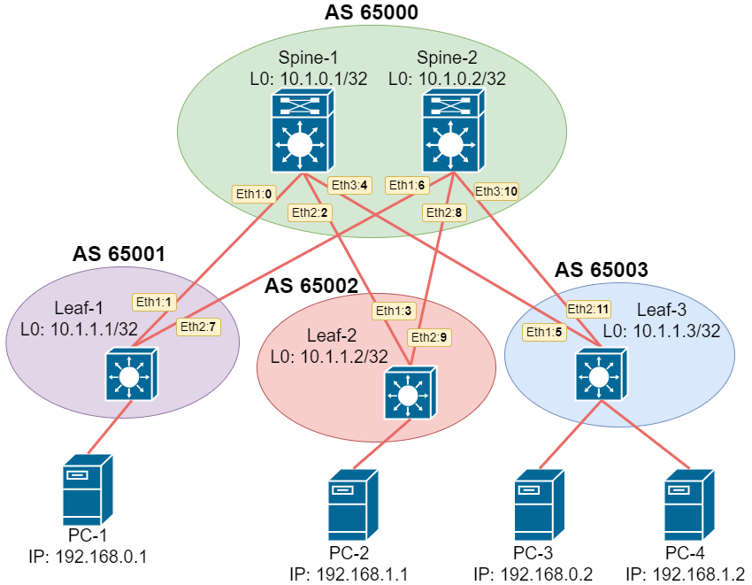

# Домашнее задание №5.
## Overlay. VxLAN EVPN L2. 
### Цель:
Настроить Overlay на основе VxLAN EVPN для L2 связанности между клиентами

### Решение.
#### 1. Схема сети
Для демонстрации работы VxLAN EVPN L2 нанесем абонентские устройства на схему сети. 


#### 2. Адресное пространство
На Leaf устройствах добавим по одному Loopback интерфейсу, чтобы использовать в качестве источника VxLAN интерфейса.  

|Name|Loopback0|Loopback0|Eth-1|Eth-2|Eth-3|
|---|---|---|---|---|---|
Spine-1|10.1.0.1/32|N/A|10.1.5.0/31|10.1.5.2/31|10.1.5.4/31|
Spine-2|10.1.0.2/32|N/A|10.1.5.6/31|10.1.5.8/31|10.1.5.10/31|
Leaf-1|10.1.1.1/32|10.1.2.1/32|10.1.5.1/31|10.1.5.7/31|N/A|
Leaf-2|10.1.1.2/32|10.1.2.2/32|10.1.5.3/31|10.1.5.9/31|N/A|
Leaf-3|10.1.1.3/32|10.1.2.3/32|10.1.5.5/31|10.1.5.11/31|N/A|

#### 3. Настройки

##### Spine-01
```
!
service routing protocols model multi-agent
!
hostname Spine-01
!
interface Ethernet1
   description ### to_Leaf-1_eth1 ###
   no switchport
   ip address 10.1.5.0/31
!
interface Ethernet2
   description ### to_Leaf-2_eth1 ###
   no switchport
   ip address 10.1.5.2/31
!
interface Ethernet3
   description ### to_Leaf-3_eth1 ###
   no switchport
   ip address 10.1.5.4/31
!
interface Loopback0
   ip address 10.1.0.1/32
!
ip prefix-list LOOPBACKS seq 10 permit 10.1.0.0/23 le 32
!
route-map LOOPBACKS permit 10
   match ip address prefix-list LOOPBACKS
!
peer-filter LEAF_AS
   10 match as-range 65001-65003 result accept
!
router bgp 65000
   router-id 10.1.0.1
   bgp listen range 10.1.1.0/24 peer-group LEAF_OVERLAY peer-filter LEAF_AS
   bgp listen range 10.1.5.0/24 peer-group LEAF_UNDERLAY peer-filter LEAF_AS
   neighbor LEAF_OVERLAY peer group
   neighbor LEAF_OVERLAY update-source Loopback0
   neighbor LEAF_OVERLAY ebgp-multihop 2
   neighbor LEAF_OVERLAY send-community
   neighbor LEAF_UNDERLAY peer group
   redistribute connected route-map LOOPBACKS
   !
   address-family evpn
      neighbor LEAF_OVERLAY activate
   !
   address-family ipv4
      no neighbor LEAF_OVERLAY activate
!
```
##### Spine-02
```
!
service routing protocols model multi-agent
!
hostname Spine-02
!
interface Ethernet1
   description ### to_Leaf-1_eth2 ###
   no switchport
   ip address 10.1.5.6/31
!
interface Ethernet2
   description ### to_Leaf-2_eth2 ###
   no switchport
   ip address 10.1.5.8/31
!
interface Ethernet3
   description ### to_Leaf-3_eth2 ###
   no switchport
   ip address 10.1.5.10/31
!
interface Loopback0
   ip address 10.1.0.2/32
!
ip routing
!
ip prefix-list LOOPBACKS seq 10 permit 10.1.0.0/23 le 32
!
route-map LOOPBACKS permit 10
   match ip address prefix-list LOOPBACKS
!
peer-filter LEAF_AS
   10 match as-range 65001-65003 result accept
!
router bgp 65000
   router-id 10.1.0.2
   bgp listen range 10.1.1.0/24 peer-group LEAF_OVERLAY peer-filter LEAF_AS
   bgp listen range 10.1.5.0/24 peer-group LEAF_UNDERLAY peer-filter LEAF_AS
   neighbor LEAF_OVERLAY peer group
   neighbor LEAF_OVERLAY update-source Loopback0
   neighbor LEAF_OVERLAY ebgp-multihop 2
   neighbor LEAF_OVERLAY send-community
   neighbor LEAF_UNDERLAY peer group
   redistribute connected route-map LOOPBACKS
   !
   address-family evpn
      neighbor LEAF_OVERLAY activate
   !
   address-family ipv4
      no neighbor LEAF_OVERLAY activate
!
```
##### Leaf-01
```
!
service routing protocols model multi-agent
!
hostname Leaf-01
!
spanning-tree mode mstp
!
vlan 10
   name ###Service-1###
!
interface Ethernet1
   description ### to_Spine-1_eth1 ###
   no switchport
   ip address 10.1.5.1/31
!
interface Ethernet2
   description ### to_Spine-2_eth1 ###
   no switchport
   ip address 10.1.5.7/31
!
interface Ethernet3
   switchport access vlan 10
!
interface Loopback0
   ip address 10.1.1.1/32
!
interface Loopback1
   ip address 10.1.2.1/32
!
interface Vxlan1
   vxlan source-interface Loopback1
   vxlan udp-port 4789
   vxlan vlan 10 vni 10010
!
ip prefix-list LOOPBACKS seq 10 permit 10.1.0.0/22 le 32
!
route-map LOOPBACKS permit 10
   match ip address prefix-list LOOPBACKS
!
router bgp 65001
   router-id 10.1.1.1
   neighbor SPINE_OVERLA peer group
   neighbor SPINE_OVERLAY peer group
   neighbor SPINE_OVERLAY remote-as 65000
   neighbor SPINE_OVERLAY update-source Loopback0
   neighbor SPINE_OVERLAY ebgp-multihop 2
   neighbor SPINE_OVERLAY send-community
   neighbor SPINE_UNDERLAY peer group
   neighbor SPINE_UNDERLAY remote-as 65000
   neighbor 10.1.0.1 peer group SPINE_OVERLAY
   neighbor 10.1.0.2 peer group SPINE_OVERLAY
   neighbor 10.1.5.0 peer group SPINE_UNDERLAY
   neighbor 10.1.5.6 peer group SPINE_UNDERLAY
   redistribute connected route-map LOOPBACKS
   !
   vlan 10
      rd 10.1.1.1:10010
      route-target both 1:10010
      redistribute learned
   !
   address-family evpn
      neighbor SPINE_OVERLAY activate
   !
   address-family ipv4
      no neighbor SPINE_OVERLAY activate
!
```
##### Leaf-02 
```
!
service routing protocols model multi-agent
!
hostname Leaf-02
!
vlan 20
   name ###Service-2###
!
interface Ethernet1
   description ### to_Spine-1_eth2 ###
   no switchport
   ip address 10.1.5.3/31
!
interface Ethernet2
   description ### to_Spine-2_eth2 ###
   no switchport
   ip address 10.1.5.9/31
!
interface Ethernet3
   switchport access vlan 20
!
interface Loopback0
   ip address 10.1.1.2/32
!
interface Loopback1
   ip address 10.1.2.2/32
!
interface Vxlan1
   vxlan source-interface Loopback1
   vxlan udp-port 4789
   vxlan vlan 20 vni 10020
!
ip routing
!
ip prefix-list LOOPBACKS seq 10 permit 10.1.0.0/22 le 32
!
route-map LOOPBACKS permit 10
   match ip address prefix-list LOOPBACKS
!
router bgp 65002
   router-id 10.1.1.2
   neighbor SPINE_OVERLAY peer group
   neighbor SPINE_OVERLAY remote-as 65000
   neighbor SPINE_OVERLAY update-source Loopback0
   neighbor SPINE_OVERLAY ebgp-multihop 2
   neighbor SPINE_OVERLAY send-community
   neighbor SPINE_UNDERLAY peer group
   neighbor SPINE_UNDERLAY remote-as 65000
   neighbor 10.1.0.1 peer group SPINE_OVERLAY
   neighbor 10.1.0.2 peer group SPINE_OVERLAY
   neighbor 10.1.5.2 peer group SPINE_UNDERLAY
   neighbor 10.1.5.8 peer group SPINE_UNDERLAY
   redistribute connected route-map LOOPBACKS
   !
   vlan 20
      rd 10.1.1.2:10020
      route-target both 1:10020
      redistribute learned
   !
   address-family evpn
      neighbor SPINE_OVERLAY activate
   !
   address-family ipv4
      no neighbor SPINE_OVERLAY activate
!
```
##### Leaf-03
```
!
service routing protocols model multi-agent
!
hostname Leaf-03
!
vlan 10
   name ###Service-1###
!
vlan 20
   name ###Service-2###
!
interface Ethernet1
   description ### to_Spine-1_eth3 ###
   no switchport
   ip address 10.1.5.5/31
!
interface Ethernet2
   description ### to_Spine-2_eth3 ###
   no switchport
   ip address 10.1.5.11/31
!
interface Ethernet3
   switchport access vlan 10
!
interface Ethernet4
   switchport access vlan 20
!
interface Loopback0
   ip address 10.1.1.3/32
!
interface Loopback1
   ip address 10.1.2.3/32
!
interface Vxlan1
   vxlan source-interface Loopback1
   vxlan udp-port 4789
   vxlan vlan 10-20 vni 10010-10020
!
ip prefix-list LOOPBACKS seq 10 permit 10.1.0.0/22 le 32
!
route-map LOOPBACKS permit 10
   match ip address prefix-list LOOPBACKS
!
router bgp 65003
   router-id 10.1.1.3
   neighbor SPINE_OVERLAY peer group
   neighbor SPINE_OVERLAY remote-as 65000
   neighbor SPINE_OVERLAY update-source Loopback0
   neighbor SPINE_OVERLAY ebgp-multihop 2
   neighbor SPINE_OVERLAY send-community
   neighbor SPINE_UNDERLAY peer group
   neighbor SPINE_UNDERLAY remote-as 65000
   neighbor 10.1.0.1 peer group SPINE_OVERLAY
   neighbor 10.1.0.2 peer group SPINE_OVERLAY
   neighbor 10.1.5.4 peer group SPINE_UNDERLAY
   neighbor 10.1.5.10 peer group SPINE_UNDERLAY
   redistribute connected route-map LOOPBACKS
   !
   vlan 10
      rd 10.1.1.3:10010
      route-target both 1:10010
      redistribute learned
   !
   vlan 20
      rd 10.1.1.3:10020
      route-target both 1:10020
      redistribute learned
   !
   address-family evpn
      neighbor SPINE_OVERLAY activate
   !
   address-family ipv4
      no neighbor SPINE_OVERLAY activate
!
```
##### Client-01
```
NAME        : VPCS[1]
IP/MASK     : 192.168.0.1/24
GATEWAY     : 192.168.0.254
```
##### Client-02
```
NAME        : VPCS[1]
IP/MASK     : 192.168.1.1/24
GATEWAY     : 192.168.1.254
```
##### Client-03
```
NAME        : VPCS[1]
IP/MASK     : 192.168.0.2/24
GATEWAY     : 192.168.0.254
```
##### Client-04
```
NAME        : VPCS[1]
IP/MASK     : 192.168.1.2/24
GATEWAY     : 192.168.1.254
```

#### 4. Демонстрация работы VxLAN EVPN L2. 

Проверим соседство и наличие маршрутов типа 3 в BGP EVPN address family. 

##### Spine-01
```
Spine-01#show bgp evpn summary
BGP summary information for VRF default
Router identifier 10.1.0.1, local AS number 65000
Neighbor Status Codes: m - Under maintenance
  Neighbor         V AS           MsgRcvd   MsgSent  InQ OutQ  Up/Down State   PfxRcd PfxAcc
  10.1.1.1         4 65001            301       292    0    0 03:43:01 Estab   1      1
  10.1.1.2         4 65002            286       286    0    0 03:42:26 Estab   1      1
  10.1.1.3         4 65003            279       262    0    0 03:35:11 Estab   2      2
```

```
Spine-01#show bgp evpn
BGP routing table information for VRF default
Router identifier 10.1.0.1, local AS number 65000
Route status codes: s - suppressed, * - valid, > - active, E - ECMP head, e - ECMP
                    S - Stale, c - Contributing to ECMP, b - backup
                    % - Pending BGP convergence
Origin codes: i - IGP, e - EGP, ? - incomplete
AS Path Attributes: Or-ID - Originator ID, C-LST - Cluster List, LL Nexthop - Link Local Nexthop

          Network                Next Hop              Metric  LocPref Weight  Path
 * >     RD: 10.1.1.1:10010 imet 10.1.2.1
                                 10.1.2.1              -       100     0       65001 i
 * >     RD: 10.1.1.2:10020 imet 10.1.2.2
                                 10.1.2.2              -       100     0       65002 i
 * >     RD: 10.1.1.3:10010 imet 10.1.2.3
                                 10.1.2.3              -       100     0       65003 i
 * >     RD: 10.1.1.3:10020 imet 10.1.2.3
                                 10.1.2.3              -       100     0       65003 i
```
##### Spine-02
```
Spine-02#show bgp evpn summary
BGP summary information for VRF default
Router identifier 10.1.0.2, local AS number 65000
Neighbor Status Codes: m - Under maintenance
  Neighbor         V AS           MsgRcvd   MsgSent  InQ OutQ  Up/Down State   PfxRcd PfxAcc
  10.1.1.1         4 65001            292       298    0    0 03:45:23 Estab   1      1
  10.1.1.2         4 65002            288       290    0    0 03:45:11 Estab   1      1
  10.1.1.3         4 65003            283       265    0    0 03:37:55 Estab   2      2
```

```
Spine-02#show bgp evpn
BGP routing table information for VRF default
Router identifier 10.1.0.2, local AS number 65000
Route status codes: s - suppressed, * - valid, > - active, E - ECMP head, e - ECMP
                    S - Stale, c - Contributing to ECMP, b - backup
                    % - Pending BGP convergence
Origin codes: i - IGP, e - EGP, ? - incomplete
AS Path Attributes: Or-ID - Originator ID, C-LST - Cluster List, LL Nexthop - Link Local Nexthop

          Network                Next Hop              Metric  LocPref Weight  Path
 * >     RD: 10.1.1.1:10010 imet 10.1.2.1
                                 10.1.2.1              -       100     0       65001 i
 * >     RD: 10.1.1.2:10020 imet 10.1.2.2
                                 10.1.2.2              -       100     0       65002 i
 * >     RD: 10.1.1.3:10010 imet 10.1.2.3
                                 10.1.2.3              -       100     0       65003 i
 * >     RD: 10.1.1.3:10020 imet 10.1.2.3
                                 10.1.2.3              -       100     0       65003 i
```
##### Leaf-01
```
Leaf-01#show bgp evpn summary
BGP summary information for VRF default
Router identifier 10.1.1.1, local AS number 65001
Neighbor Status Codes: m - Under maintenance
  Neighbor         V AS           MsgRcvd   MsgSent  InQ OutQ  Up/Down State   PfxRcd PfxAcc
  10.1.0.1         4 65000            447       468    0    0 03:46:45 Estab   3      3
  10.1.0.2         4 65000            418       408    0    0 03:46:22 Estab   3      3
```

```
Leaf-01#show bgp evpn
BGP routing table information for VRF default
Router identifier 10.1.1.1, local AS number 65001
Route status codes: s - suppressed, * - valid, > - active, E - ECMP head, e - ECMP
                    S - Stale, c - Contributing to ECMP, b - backup
                    % - Pending BGP convergence
Origin codes: i - IGP, e - EGP, ? - incomplete
AS Path Attributes: Or-ID - Originator ID, C-LST - Cluster List, LL Nexthop - Link Local Nexthop

          Network                Next Hop              Metric  LocPref Weight  Path
 * >     RD: 10.1.1.1:10010 imet 10.1.2.1
                                 -                     -       -       0       i
 * >Ec   RD: 10.1.1.2:10020 imet 10.1.2.2
                                 10.1.2.2              -       100     0       65000 65002 i
 *  ec   RD: 10.1.1.2:10020 imet 10.1.2.2
                                 10.1.2.2              -       100     0       65000 65002 i
 * >Ec   RD: 10.1.1.3:10010 imet 10.1.2.3
                                 10.1.2.3              -       100     0       65000 65003 i
 *  ec   RD: 10.1.1.3:10010 imet 10.1.2.3
                                 10.1.2.3              -       100     0       65000 65003 i
 * >Ec   RD: 10.1.1.3:10020 imet 10.1.2.3
                                 10.1.2.3              -       100     0       65000 65003 i
 *  ec   RD: 10.1.1.3:10020 imet 10.1.2.3
                                 10.1.2.3              -       100     0       65000 65003 i
Leaf-01#
```
##### Leaf-02 
```
Leaf-02#show bgp evpn summary
BGP summary information for VRF default
Router identifier 10.1.1.2, local AS number 65002
Neighbor Status Codes: m - Under maintenance
  Neighbor         V AS           MsgRcvd   MsgSent  InQ OutQ  Up/Down State   PfxRcd PfxAcc
  10.1.0.1         4 65000            398       410    0    0 03:50:16 Estab   3      3
  10.1.0.2         4 65000            397       400    0    0 03:50:16 Estab   3      3
```

```
Leaf-02#show bgp evpn
BGP routing table information for VRF default
Router identifier 10.1.1.2, local AS number 65002
Route status codes: s - suppressed, * - valid, > - active, E - ECMP head, e - ECMP
                    S - Stale, c - Contributing to ECMP, b - backup
                    % - Pending BGP convergence
Origin codes: i - IGP, e - EGP, ? - incomplete
AS Path Attributes: Or-ID - Originator ID, C-LST - Cluster List, LL Nexthop - Link Local Nexthop

          Network                Next Hop              Metric  LocPref Weight  Path
 * >Ec   RD: 10.1.1.1:10010 imet 10.1.2.1
                                 10.1.2.1              -       100     0       65000 65001 i
 *  ec   RD: 10.1.1.1:10010 imet 10.1.2.1
                                 10.1.2.1              -       100     0       65000 65001 i
 * >     RD: 10.1.1.2:10020 imet 10.1.2.2
                                 -                     -       -       0       i
 * >Ec   RD: 10.1.1.3:10010 imet 10.1.2.3
                                 10.1.2.3              -       100     0       65000 65003 i
 *  ec   RD: 10.1.1.3:10010 imet 10.1.2.3
                                 10.1.2.3              -       100     0       65000 65003 i
 * >Ec   RD: 10.1.1.3:10020 imet 10.1.2.3
                                 10.1.2.3              -       100     0       65000 65003 i
 *  ec   RD: 10.1.1.3:10020 imet 10.1.2.3
                                 10.1.2.3              -       100     0       65000 65003 i
```
##### Leaf-03
```
Leaf-03#show bgp evpn summary
BGP summary information for VRF default
Router identifier 10.1.1.3, local AS number 65003
Neighbor Status Codes: m - Under maintenance
  Neighbor         V AS           MsgRcvd   MsgSent  InQ OutQ  Up/Down State   PfxRcd PfxAcc
  10.1.0.1         4 65000            280       299    0    0 03:41:03 Estab   2      2
  10.1.0.2         4 65000            280       300    0    0 03:41:03 Estab   2      2
```

```
Leaf-03#show bgp evpn
BGP routing table information for VRF default
Router identifier 10.1.1.3, local AS number 65003
Route status codes: s - suppressed, * - valid, > - active, E - ECMP head, e - ECMP
                    S - Stale, c - Contributing to ECMP, b - backup
                    % - Pending BGP convergence
Origin codes: i - IGP, e - EGP, ? - incomplete
AS Path Attributes: Or-ID - Originator ID, C-LST - Cluster List, LL Nexthop - Link Local Nexthop

          Network                Next Hop              Metric  LocPref Weight  Path
 * >Ec   RD: 10.1.1.1:10010 imet 10.1.2.1
                                 10.1.2.1              -       100     0       65000 65001 i
 *  ec   RD: 10.1.1.1:10010 imet 10.1.2.1
                                 10.1.2.1              -       100     0       65000 65001 i
 * >Ec   RD: 10.1.1.2:10020 imet 10.1.2.2
                                 10.1.2.2              -       100     0       65000 65002 i
 *  ec   RD: 10.1.1.2:10020 imet 10.1.2.2
                                 10.1.2.2              -       100     0       65000 65002 i
 * >     RD: 10.1.1.3:10010 imet 10.1.2.3
                                 -                     -       -       0       i
 * >     RD: 10.1.1.3:10020 imet 10.1.2.3
                                 -                     -       -       0       i
```

Проверяем сетевое взаимодействие клиентских устройств

##### Client-01
```
VPCS> ping 192.168.0.2

84 bytes from 192.168.0.2 icmp_seq=1 ttl=64 time=65.078 ms
84 bytes from 192.168.0.2 icmp_seq=2 ttl=64 time=35.620 ms
84 bytes from 192.168.0.2 icmp_seq=3 ttl=64 time=27.847 ms
84 bytes from 192.168.0.2 icmp_seq=4 ttl=64 time=41.399 ms
84 bytes from 192.168.0.2 icmp_seq=5 ttl=64 time=23.467 ms
```
##### Client-02
```
VPCS> ping 192.168.1.2

84 bytes from 192.168.1.2 icmp_seq=1 ttl=64 time=79.145 ms
84 bytes from 192.168.1.2 icmp_seq=2 ttl=64 time=34.785 ms
84 bytes from 192.168.1.2 icmp_seq=3 ttl=64 time=30.982 ms
84 bytes from 192.168.1.2 icmp_seq=4 ttl=64 time=33.897 ms
84 bytes from 192.168.1.2 icmp_seq=5 ttl=64 time=24.670 ms
```
##### Client-03
```
VPCS> ping 192.168.0.1

84 bytes from 192.168.0.1 icmp_seq=1 ttl=64 time=48.626 ms
84 bytes from 192.168.0.1 icmp_seq=2 ttl=64 time=46.194 ms
84 bytes from 192.168.0.1 icmp_seq=3 ttl=64 time=23.423 ms
84 bytes from 192.168.0.1 icmp_seq=4 ttl=64 time=22.681 ms
84 bytes from 192.168.0.1 icmp_seq=5 ttl=64 time=48.249 ms
```
##### Client-04
```
VPCS> ping 192.168.1.1

84 bytes from 192.168.1.1 icmp_seq=1 ttl=64 time=42.132 ms
84 bytes from 192.168.1.1 icmp_seq=2 ttl=64 time=27.224 ms
84 bytes from 192.168.1.1 icmp_seq=3 ttl=64 time=32.065 ms
84 bytes from 192.168.1.1 icmp_seq=4 ttl=64 time=22.093 ms
84 bytes from 192.168.1.1 icmp_seq=5 ttl=64 time=21.733 ms
```

Фиксируем данные на коммутаторах   
##### Spine-01
```
Spine-01#show bgp evpn route-type mac-ip
BGP routing table information for VRF default
Router identifier 10.1.0.1, local AS number 65000
Route status codes: s - suppressed, * - valid, > - active, E - ECMP head, e - ECMP
                    S - Stale, c - Contributing to ECMP, b - backup
                    % - Pending BGP convergence
Origin codes: i - IGP, e - EGP, ? - incomplete
AS Path Attributes: Or-ID - Originator ID, C-LST - Cluster List, LL Nexthop - Link Local Nexthop

          Network                Next Hop              Metric  LocPref Weight  Path
 * >     RD: 10.1.1.1:10010 mac-ip 0050.7966.680f
                                 10.1.2.1              -       100     0       65001 i
 * >     RD: 10.1.1.2:10020 mac-ip 0050.7966.6810
                                 10.1.2.2              -       100     0       65002 i
 * >     RD: 10.1.1.3:10010 mac-ip 0050.7966.6811
                                 10.1.2.3              -       100     0       65003 i
 * >     RD: 10.1.1.3:10020 mac-ip 0050.7966.6812
                                 10.1.2.3              -       100     0       65003 i
```
##### Spine-02
```
Spine-02#show bgp evpn route-type mac-ip
BGP routing table information for VRF default
Router identifier 10.1.0.2, local AS number 65000
Route status codes: s - suppressed, * - valid, > - active, E - ECMP head, e - ECMP
                    S - Stale, c - Contributing to ECMP, b - backup
                    % - Pending BGP convergence
Origin codes: i - IGP, e - EGP, ? - incomplete
AS Path Attributes: Or-ID - Originator ID, C-LST - Cluster List, LL Nexthop - Link Local Nexthop

          Network                Next Hop              Metric  LocPref Weight  Path
 * >     RD: 10.1.1.1:10010 mac-ip 0050.7966.680f
                                 10.1.2.1              -       100     0       65001 i
 * >     RD: 10.1.1.2:10020 mac-ip 0050.7966.6810
                                 10.1.2.2              -       100     0       65002 i
 * >     RD: 10.1.1.3:10010 mac-ip 0050.7966.6811
                                 10.1.2.3              -       100     0       65003 i
 * >     RD: 10.1.1.3:10020 mac-ip 0050.7966.6812
                                 10.1.2.3              -       100     0       65003 i

```
##### Leaf-01
```
Leaf-01#show bgp evpn route-type mac-ip
BGP routing table information for VRF default
Router identifier 10.1.1.1, local AS number 65001
Route status codes: s - suppressed, * - valid, > - active, E - ECMP head, e - ECMP
                    S - Stale, c - Contributing to ECMP, b - backup
                    % - Pending BGP convergence
Origin codes: i - IGP, e - EGP, ? - incomplete
AS Path Attributes: Or-ID - Originator ID, C-LST - Cluster List, LL Nexthop - Link Local Nexthop

          Network                Next Hop              Metric  LocPref Weight  Path
 * >     RD: 10.1.1.1:10010 mac-ip 0050.7966.680f
                                 -                     -       -       0       i
 * >Ec   RD: 10.1.1.2:10020 mac-ip 0050.7966.6810
                                 10.1.2.2              -       100     0       65000 65002 i
 *  ec   RD: 10.1.1.2:10020 mac-ip 0050.7966.6810
                                 10.1.2.2              -       100     0       65000 65002 i
 * >Ec   RD: 10.1.1.3:10010 mac-ip 0050.7966.6811
                                 10.1.2.3              -       100     0       65000 65003 i
 *  ec   RD: 10.1.1.3:10010 mac-ip 0050.7966.6811
                                 10.1.2.3              -       100     0       65000 65003 i
 * >Ec   RD: 10.1.1.3:10020 mac-ip 0050.7966.6812
                                 10.1.2.3              -       100     0       65000 65003 i
 *  ec   RD: 10.1.1.3:10020 mac-ip 0050.7966.6812
                                 10.1.2.3              -       100     0       65000 65003 i
```

```
Leaf-01#show vxlan address-table
          Vxlan Mac Address Table
----------------------------------------------------------------------

VLAN  Mac Address     Type      Prt  VTEP             Moves   Last Move
----  -----------     ----      ---  ----             -----   ---------
  10  0050.7966.6811  EVPN      Vx1  10.1.2.3         1       0:03:36 ago
Total Remote Mac Addresses for this criterion: 1
```

```
Leaf-01#show mac address-table
          Mac Address Table
------------------------------------------------------------------

Vlan    Mac Address       Type        Ports      Moves   Last Move
----    -----------       ----        -----      -----   ---------
  10    0050.7966.680f    DYNAMIC     Et3        1       0:03:44 ago
  10    0050.7966.6811    DYNAMIC     Vx1        1       0:03:43 ago
Total Mac Addresses for this criterion: 2

          Multicast Mac Address Table
------------------------------------------------------------------

Vlan    Mac Address       Type        Ports
----    -----------       ----        -----
Total Mac Addresses for this criterion: 0
```
##### Leaf-02 
```
Leaf-02#show bgp evpn route-type mac-ip
BGP routing table information for VRF default
Router identifier 10.1.1.2, local AS number 65002
Route status codes: s - suppressed, * - valid, > - active, E - ECMP head, e - ECMP
                    S - Stale, c - Contributing to ECMP, b - backup
                    % - Pending BGP convergence
Origin codes: i - IGP, e - EGP, ? - incomplete
AS Path Attributes: Or-ID - Originator ID, C-LST - Cluster List, LL Nexthop - Link Local Nexthop

          Network                Next Hop              Metric  LocPref Weight  Path
 * >Ec   RD: 10.1.1.1:10010 mac-ip 0050.7966.680f
                                 10.1.2.1              -       100     0       65000 65001 i
 *  ec   RD: 10.1.1.1:10010 mac-ip 0050.7966.680f
                                 10.1.2.1              -       100     0       65000 65001 i
 * >     RD: 10.1.1.2:10020 mac-ip 0050.7966.6810
                                 -                     -       -       0       i
 * >Ec   RD: 10.1.1.3:10010 mac-ip 0050.7966.6811
                                 10.1.2.3              -       100     0       65000 65003 i
 *  ec   RD: 10.1.1.3:10010 mac-ip 0050.7966.6811
                                 10.1.2.3              -       100     0       65000 65003 i
 * >Ec   RD: 10.1.1.3:10020 mac-ip 0050.7966.6812
                                 10.1.2.3              -       100     0       65000 65003 i
 *  ec   RD: 10.1.1.3:10020 mac-ip 0050.7966.6812
                                 10.1.2.3              -       100     0       65000 65003 i
```

```
Leaf-02#show vxlan address-table
          Vxlan Mac Address Table
----------------------------------------------------------------------

VLAN  Mac Address     Type      Prt  VTEP             Moves   Last Move
----  -----------     ----      ---  ----             -----   ---------
  20  0050.7966.6812  EVPN      Vx1  10.1.2.3         1       0:04:03 ago
Total Remote Mac Addresses for this criterion: 1
```

```
Leaf-02#show mac address-table
          Mac Address Table
------------------------------------------------------------------

Vlan    Mac Address       Type        Ports      Moves   Last Move
----    -----------       ----        -----      -----   ---------
  20    0050.7966.6810    DYNAMIC     Et3        1       0:04:09 ago
  20    0050.7966.6812    DYNAMIC     Vx1        1       0:04:09 ago
Total Mac Addresses for this criterion: 2

          Multicast Mac Address Table
------------------------------------------------------------------

Vlan    Mac Address       Type        Ports
----    -----------       ----        -----
Total Mac Addresses for this criterion: 0
```
##### Leaf-03
```
Leaf-03#show bgp evpn route-type mac-ip
BGP routing table information for VRF default
Router identifier 10.1.1.3, local AS number 65003
Route status codes: s - suppressed, * - valid, > - active, E - ECMP head, e - ECMP
                    S - Stale, c - Contributing to ECMP, b - backup
                    % - Pending BGP convergence
Origin codes: i - IGP, e - EGP, ? - incomplete
AS Path Attributes: Or-ID - Originator ID, C-LST - Cluster List, LL Nexthop - Link Local Nexthop

          Network                Next Hop              Metric  LocPref Weight  Path
 * >Ec   RD: 10.1.1.1:10010 mac-ip 0050.7966.680f
                                 10.1.2.1              -       100     0       65000 65001 i
 *  ec   RD: 10.1.1.1:10010 mac-ip 0050.7966.680f
                                 10.1.2.1              -       100     0       65000 65001 i
 * >Ec   RD: 10.1.1.2:10020 mac-ip 0050.7966.6810
                                 10.1.2.2              -       100     0       65000 65002 i
 *  ec   RD: 10.1.1.2:10020 mac-ip 0050.7966.6810
                                 10.1.2.2              -       100     0       65000 65002 i
 * >     RD: 10.1.1.3:10010 mac-ip 0050.7966.6811
                                 -                     -       -       0       i
 * >     RD: 10.1.1.3:10020 mac-ip 0050.7966.6812
                                 -                     -       -       0       i
```
```
Leaf-03#show vxlan address-table
          Vxlan Mac Address Table
----------------------------------------------------------------------

VLAN  Mac Address     Type      Prt  VTEP             Moves   Last Move
----  -----------     ----      ---  ----             -----   ---------
  10  0050.7966.680f  EVPN      Vx1  10.1.2.1         1       0:04:42 ago
  20  0050.7966.6810  EVPN      Vx1  10.1.2.2         1       0:04:37 ago
Total Remote Mac Addresses for this criterion: 2
```

```
Leaf-03#show mac address-table
          Mac Address Table
------------------------------------------------------------------

Vlan    Mac Address       Type        Ports      Moves   Last Move
----    -----------       ----        -----      -----   ---------
  10    0050.7966.680f    DYNAMIC     Vx1        1       0:04:50 ago
  10    0050.7966.6811    DYNAMIC     Et3        1       0:04:50 ago
  20    0050.7966.6810    DYNAMIC     Vx1        1       0:04:45 ago
  20    0050.7966.6812    DYNAMIC     Et4        1       0:04:45 ago
Total Mac Addresses for this criterion: 4

          Multicast Mac Address Table
------------------------------------------------------------------

Vlan    Mac Address       Type        Ports
----    -----------       ----        -----
Total Mac Addresses for this criterion: 0
```


