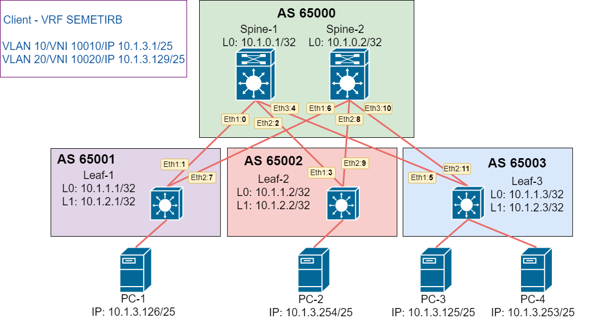

# Домашнее задание №6.
## Overlay. VxLAN EVPN L3. 
### Цель:
Настроить маршрутизацию в рамках Overlay между клиентами

### Решение.
Доработаем лабораторную работу №5 для организации маршрутизации между клиентами в разных подсетях. 

#### 1. Схема сети

#### 2. Адресное пространство
Адресация сетевых устройств:

|Name|Loopback0|Loopback1|Eth-1|Eth-2|Eth-3|
|---|---|---|---|---|---|
Spine-1|10.1.0.1/32|N/A|10.1.5.0/31|10.1.5.2/31|10.1.5.4/31|
Spine-2|10.1.0.2/32|N/A|10.1.5.6/31|10.1.5.8/31|10.1.5.10/31|
Leaf-1|10.1.1.1/32|10.1.2.1/32|10.1.5.1/31|10.1.5.7/31|N/A|
Leaf-2|10.1.1.2/32|10.1.2.2/32|10.1.5.3/31|10.1.5.9/31|N/A|
Leaf-3|10.1.1.3/32|10.1.2.3/32|10.1.5.5/31|10.1.5.11/31|N/A|

Адресация клиентских устройств:
|Name|Client-1|Client-2|Client-3|Client-4|
|---|---|---|---|---|
IP/MASK|10.1.3.126/25|10.1.3.254/25|10.1.3.125/25|10.1.3.253/25|
GW|10.1.3.1|10.1.3.129|10.1.3.1|10.1.5.8/31|10.1.3.129|
