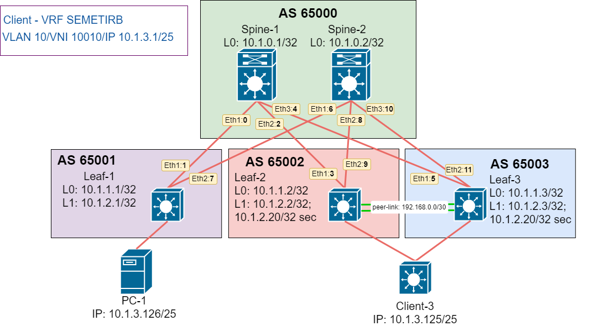

# Домашнее задание №7.
## VxLAN M-LAG. 
### Цель:
Настроить отказоустойчивое подключение клиентов с использованием M-LAG 

### Решение.
Модифицируем лабораторную работу №6 для возможности отказоустойчивого подключения клиентов. Настройку произведем на оборудованиии Arista, поэтому развернем Multi-Chassis LAG (MLAG).

#### 1. Схема сети


#### 2. Адресное пространство

Адресация сетевых устройств:
|Name|Loopback0|Loopback1|Loopback1 sec|Eth-1|Eth-2|Eth-3|
|---|---|---|---|---|---|---|
Spine-1|10.1.0.1/32|N/A|N/A|10.1.5.0/31|10.1.5.2/31|10.1.5.4/31|
Spine-2|10.1.0.2/32|N/A|N/A|10.1.5.6/31|10.1.5.8/31|10.1.5.10/31|
Leaf-1|10.1.1.1/32|10.1.2.1/32|N/A|10.1.5.1/31|10.1.5.7/31|N/A|
Leaf-2|10.1.1.2/32|10.1.2.2/32|10.1.2.20/32|10.1.5.3/31|10.1.5.9/31|N/A|
Leaf-3|10.1.1.3/32|10.1.2.3/32|10.1.2.20/32|10.1.5.5/31|10.1.5.11/31|N/A|

Адресация клиентских устройств:
|Name|Client-1|Client-3|
|---|---|---|
IP/MASK|10.1.3.126/25|10.1.3.125/25|

#### 3. Настройки

Приведены донастройки для организации M-LAG.

##### Leaf-01
```
!
hostname Leaf-01
!
vlan 10
   name ###Service-1###
!
vrf instance SEMETIRB
!
interface Ethernet1
   description ### to_Spine-1_eth1 ###
   no switchport
   ip address 10.1.5.1/31
!
interface Ethernet2
   description ### to_Spine-2_eth1 ###
   no switchport
   ip address 10.1.5.7/31
!
interface Ethernet3
   description ### Client-1 ###
   switchport access vlan 10
!
interface Loopback0
   ip address 10.1.1.1/32
!
interface Loopback1
   ip address 10.1.2.1/32
!
interface Vxlan1
   vxlan source-interface Loopback1
   vxlan udp-port 4789
   vxlan vlan 10-20 vni 10010-10020
   vxlan vrf SEMETIRB vni 65000
   vxlan vlan 10 flood vtep 10.1.2.20
!
ip virtual-router mac-address 00:11:22:33:44:55
!
ip routing
ip routing vrf SEMETIRB
!
ip prefix-list LOOPBACKS seq 10 permit 10.1.0.0/22 le 32
!
route-map LOOPBACKS permit 10
   match ip address prefix-list LOOPBACKS
!
router bgp 65001
   router-id 10.1.1.1
   maximum-paths 128
   neighbor SPINE_OVERLA peer group
   neighbor SPINE_OVERLAY peer group
   neighbor SPINE_OVERLAY remote-as 65000
   neighbor SPINE_OVERLAY update-source Loopback0
   neighbor SPINE_OVERLAY ebgp-multihop 10
   neighbor SPINE_OVERLAY send-community
   neighbor SPINE_UNDERLAY peer group
   neighbor SPINE_UNDERLAY remote-as 65000
   neighbor 10.1.0.1 peer group SPINE_OVERLAY
   neighbor 10.1.0.2 peer group SPINE_OVERLAY
   neighbor 10.1.5.0 peer group SPINE_UNDERLAY
   neighbor 10.1.5.6 peer group SPINE_UNDERLAY
   redistribute connected route-map LOOPBACKS
   !
   vlan 10
      rd 10.1.1.1:10010
      route-target both 1:10010
      redistribute learned
   !
   address-family evpn
      neighbor SPINE_OVERLAY activate
   !
   address-family ipv4
      no neighbor SPINE_OVERLAY activate
   !
   vrf SEMETIRB
      rd 10.1.1.1:65000
      route-target import evpn 1:65000
      route-target export evpn 1:65000
      redistribute connected
!
```

##### Leaf-02 
```
!
hostname Leaf-02
!
vlan 10
   name ###Service-1###
!
vlan 20
   name ###Service-2###
!
vlan 4094
   name for_M-LAG
!
vrf instance SEMETIRB
!
interface Port-Channel10
   description ### M-LAG peer-link ###
   switchport mode trunk
!
interface Port-Channel15
   switchport access vlan 10
   mlag 10
!
interface Ethernet1
   description ### to_Spine-1_eth2 ###
   no switchport
   ip address 10.1.5.3/31
!
interface Ethernet2
   description ### to_Spine-2_eth2 ###
   no switchport
   ip address 10.1.5.9/31
!
interface Ethernet3
   description ### Client-2 ###
   switchport access vlan 20
!
interface Ethernet5
   description ### to_M-LAG_client ###
   channel-group 15 mode active
!
interface Ethernet7
   description ### Peer-link ###
   channel-group 10 mode active
!
interface Ethernet8
   description ### Peer-link ###
   channel-group 10 mode active
!
interface Loopback0
   ip address 10.1.1.2/32
!
interface Loopback1
   ip address 10.1.2.2/32
   ip address 10.1.2.20/32 secondary
!
interface Vlan20
   description ### Client-2 ###
   vrf SEMETIRB
   ip address virtual 10.1.3.129/25
!
interface Vlan4094
   description ### M-LAG peer-link ###
   ip address 192.168.0.1/30
!
interface Vxlan1
   vxlan source-interface Loopback1
   vxlan udp-port 4789
   vxlan vlan 10-20 vni 10010-10020
   vxlan vrf SEMETIRB vni 65000
   vxlan vlan 10 flood vtep 10.1.2.1
!
ip virtual-router mac-address 00:11:22:33:44:55
!
ip routing
ip routing vrf SEMETIRB
!
ip prefix-list LOOPBACKS seq 10 permit 10.1.0.0/22 le 32
!
mlag configuration
   domain-id Arista-1
   local-interface Vlan4094
   peer-address 192.168.0.2
   peer-link Port-Channel10
   dual-primary detection delay 5 action errdisable all-interfaces
   dual-primary recovery delay mlag 15 non-mlag 30
!
route-map LOOPBACKS permit 10
   match ip address prefix-list LOOPBACKS
!
router bgp 65002
   router-id 10.1.1.2
   neighbor SPINE_OVERLAY peer group
   neighbor SPINE_OVERLAY remote-as 65000
   neighbor SPINE_OVERLAY update-source Loopback0
   neighbor SPINE_OVERLAY ebgp-multihop 2
   neighbor SPINE_OVERLAY send-community
   neighbor SPINE_UNDERLAY peer group
   neighbor SPINE_UNDERLAY remote-as 65000
   neighbor 10.1.0.1 peer group SPINE_OVERLAY
   neighbor 10.1.0.2 peer group SPINE_OVERLAY
   neighbor 10.1.5.2 peer group SPINE_UNDERLAY
   neighbor 10.1.5.8 peer group SPINE_UNDERLAY
   redistribute connected route-map LOOPBACKS
   !
   vlan 10
      rd 10.1.1.2:10010
      route-target both 1:10010
      redistribute learned
   !
   vlan 20
      rd 10.1.1.2:10020
      route-target both 1:10020
      redistribute learned
   !
   address-family evpn
      neighbor SPINE_OVERLAY activate
   !
   address-family ipv4
      no neighbor SPINE_OVERLAY activate
   !
   vrf SEMETIRB
      rd 10.1.1.2:65000
      route-target import evpn 1:65000
      route-target export evpn 1:65000
      redistribute connected
!
```

##### Leaf-03
```
!
hostname Leaf-03
!
vlan 10
   name ###Service-1###
!
vlan 20
   name ###Service-2###
!
vlan 4094
   name for_M-LAG
!
vrf instance SEMETIRB
!
interface Port-Channel10
   description ### M-LAG peer-link ###
   switchport mode trunk
!
interface Port-Channel15
   switchport access vlan 10
   mlag 10
!
interface Ethernet1
   description ### to_Spine-1_eth3 ###
   no switchport
   ip address 10.1.5.5/31
!
interface Ethernet2
   description ### to_Spine-2_eth3 ###
   no switchport
   ip address 10.1.5.11/31
!
interface Ethernet3
   description ### Client-1 ###
   switchport access vlan 10
!
interface Ethernet4
   description ### Client-2 ###
   switchport access vlan 20
!
interface Ethernet5
   description ### to_M-LAG_client ###
   channel-group 15 mode active
!
interface Ethernet7
   description ### Peer-link ###
   channel-group 10 mode active
!
interface Ethernet8
   description ### Peer-link ###
   channel-group 10 mode active
!
interface Loopback0
   ip address 10.1.1.3/32
!
interface Loopback1
   ip address 10.1.2.3/32
   ip address 10.1.2.20/32 secondary
!
interface Vlan20
   description ### Client-2 ###
   vrf SEMETIRB
   ip address virtual 10.1.3.129/25
!
interface Vlan4094
   description ### M-LAG peer-link ###
   ip address 192.168.0.2/30
!
interface Vxlan1
   vxlan source-interface Loopback1
   vxlan udp-port 4789
   vxlan vlan 10-20 vni 10010-10020
   vxlan vrf SEMETIRB vni 65000
   vxlan vlan 10 flood vtep 10.1.2.1
!
ip virtual-router mac-address 00:11:22:33:44:55
!
ip routing
ip routing vrf SEMETIRB
!
ip prefix-list LOOPBACKS seq 10 permit 10.1.0.0/22 le 32
!
mlag configuration
   domain-id Arista-1
   local-interface Vlan4094
   peer-address 192.168.0.1
   peer-link Port-Channel10
   dual-primary detection delay 5 action errdisable all-interfaces
   dual-primary recovery delay mlag 15 non-mlag 30
!
route-map LOOPBACKS permit 10
   match ip address prefix-list LOOPBACKS
!
router bgp 65003
   router-id 10.1.1.3
   neighbor SPINE_OVERLAY peer group
   neighbor SPINE_OVERLAY remote-as 65000
   neighbor SPINE_OVERLAY update-source Loopback0
   neighbor SPINE_OVERLAY ebgp-multihop 10
   neighbor SPINE_OVERLAY send-community
   neighbor SPINE_UNDERLAY peer group
   neighbor SPINE_UNDERLAY remote-as 65000
   neighbor 10.1.0.1 peer group SPINE_OVERLAY
   neighbor 10.1.0.2 peer group SPINE_OVERLAY
   neighbor 10.1.5.4 peer group SPINE_UNDERLAY
   neighbor 10.1.5.10 peer group SPINE_UNDERLAY
   redistribute connected route-map LOOPBACKS
   !
   vlan 10
      rd 10.1.1.3:10010
      route-target both 1:10010
      redistribute learned
   !
   vlan 20
      rd 10.1.1.3:10020
      route-target both 1:10020
      redistribute learned
   !
   address-family evpn
      neighbor SPINE_OVERLAY activate
   !
   address-family ipv4
      no neighbor SPINE_OVERLAY activate
   !
   vrf SEMETIRB
      rd 10.1.1.3:65000
      route-target import evpn 1:65000
      route-target export evpn 1:65000
      redistribute connected
!
```

##### Client-01
```
NAME : VPCS[1]
IP/MASK : 10.1.3.126/25
GATEWAY : 10.1.3.1
```

##### Client-03
```
!
hostname Client-3
!
vlan 10
   name test_M-LAG
!
interface Port-Channel15
   switchport access vlan 10
!
interface Ethernet1
   switchport access vlan 10
   channel-group 15 mode active
!
interface Ethernet2
   switchport access vlan 10
   channel-group 15 mode active
!
interface Vlan10
   description ### test_M-LAG ###
   ip address 10.1.3.125/25
!
```

#### 4. Демонстрация работы VxLAN MLAG.
Проверим локальное взаимодействие Client-1 c Client-3 и наоборот.

##### Client-01
```
VPCS> ping 10.1.3.125
84 bytes from 10.1.3.125 icmp_seq=1 ttl=64 time=45.056 ms
84 bytes from 10.1.3.125 icmp_seq=2 ttl=64 time=26.370 ms
84 bytes from 10.1.3.125 icmp_seq=3 ttl=64 time=39.932 ms
84 bytes from 10.1.3.125 icmp_seq=4 ttl=64 time=29.254 ms
84 bytes from 10.1.3.125 icmp_seq=5 ttl=64 time=30.432 ms
```

##### Client-03
```
Client-3#ping 10.1.3.126
PING 10.1.3.126 (10.1.3.126) 72(100) bytes of data.
80 bytes from 10.1.3.126: icmp_seq=1 ttl=64 time=63.8 ms
80 bytes from 10.1.3.126: icmp_seq=2 ttl=64 time=60.4 ms
80 bytes from 10.1.3.126: icmp_seq=3 ttl=64 time=56.0 ms
80 bytes from 10.1.3.126: icmp_seq=4 ttl=64 time=53.4 ms
80 bytes from 10.1.3.126: icmp_seq=5 ttl=64 time=49.7 ms
--- 10.1.3.126 ping statistics ---
5 packets transmitted, 5 received, 0% packet loss, time 47ms
rtt min/avg/max/mdev = 49.713/56.723/63.857/5.005 ms, pipe 5, ipg/ewma 11.852/59.928 ms
```