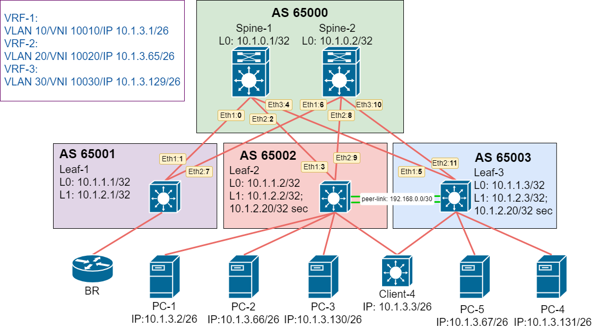

# Домашнее задание №8.
## EVPN route-type 5. 
### Цель:
Реализовать передачу суммарных префиксов через EVPN route-type 5 

### Решение.
Доработаем лабораторную работу №7 для возможности установки EVPN route-type 5 в таблицы маршрутизации VxLAN VRF. 

#### 1. Схема сети

#### 2. Адресное пространство

Адресация сетевых устройств:
|Name|Loopback0|Loopback1|Eth-1|Eth-2|Eth-3|
|---|---|---|---|---|---|
Spine-1|10.1.0.1/32|N/A|10.1.5.0/31|10.1.5.2/31|10.1.5.4/31|
Spine-2|10.1.0.2/32|N/A|10.1.5.6/31|10.1.5.8/31|10.1.5.10/31|
Leaf-1|10.1.1.1/32|10.1.2.1/32|10.1.5.1/31|10.1.5.7/31|N/A|
Leaf-2|10.1.1.2/32|10.1.2.2/32|10.1.5.3/31|10.1.5.9/31|N/A|
Leaf-3|10.1.1.3/32|10.1.2.3/32|10.1.5.5/31|10.1.5.11/31|N/A|

Адресация в VRF:
|Name|VRF-1|VRF-2|VRF-1|
|---|---|---|---|
Client NET|10.1.3.0/26|10.1.3.64/26|10.1.3.128/26|
p2p BR|172.16.1.0/30|172.16.2.0/30|172.16.3.0/30|

#### 3. Настройки
VxLAN фабрика реализована на eBGP для организации маршрутизации между VRF через BR роутер необходимо разрешить повторяющиеся номера AS в AS_PATH атрибуте.
